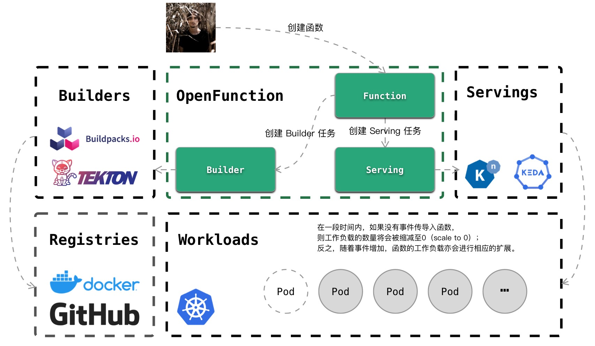

# OpenFunction(Cloud native Functions-as-a-Service Platform)

---

## Overview

----

OpenFunction 是一个云原生开源的 FaaS (Function as a Service) 平台，主要目标是使用户更关注自己的业务逻辑，无需关系业务的运行环境及底层基础设施，用户只需以函数的形式提交业务相关的源代码。

OpenFunction 包含且不限于以下特性：

- 将业务相关的函数源代码转换成可运行的应用的源代码
- 将转换后的应用源代码生成可部署的容器镜像
- 将生成的容器镜像部署到底层运行环境如 K8s，并可根据业务流量自动扩缩容，可在没有流量的时候缩容为 0
- 提供触发函数的事件管理功能
- 提供管理函数版本、流量入口等附加功能



## Prerequisites

---

当前 OpenFunction 的版本要求您具备一个版本```>=1.18.6``` 的 Kubernetes 集群。

此外，您需要为 OpenFunction 的抽象组件```Builder```、```Serving```部署实现组件。

#### Builder

您可以从以下方案中进行选择：

- 基于 Tekton 与 Cloud Native Buildpacks 完成 OpenFunction Builder 基础实现，您需要先 [安装 Tekton 项目](https://tekton.dev/docs/getting-started/#installation) ，再与 [Cloud Native Buildpacks 项目进行集成](https://buildpacks.io/docs/tools/tekton/) 。

#### Serving

您可以从以下方案中进行选择：

- 基于 Knative 完成 OpenFunction Serving 基础实现，您需要 [安装 Knative 项目](https://knative.dev/docs/install/) 。

## CustomResourceDefinitions

---

OpenFunction 的核心功能是服务于用户，使其具备以代码函数的执行单位来开发、运行、管理业务应用。OpenFunction 的实现基于以下 [custom resource definitions (CRDs)](https://kubernetes.io/docs/tasks/access-kubernetes-api/extend-api-custom-resource-definitions/):

- **```Function```**，函数的抽象定义。
- **```Builder```**，函数构建者的抽象定义。
- **```Serving```**，函数负载的抽象定义。

## QuickStart

---

### Install

您可以在选择一个合适的版本后，通过执行以下命令来快速构建一个 OpenFunction 平台：

```shell
kubectl apply -f config/bundle.yaml
```

> 注意：当使用非 default namespaces 时，请先确认 namespace 中的 ClusterRoleBinding 是否适配。

### Sample: Run a function.

如果您已经完成 OpenFunction Builder 与 OpenFunction Serving 的基础实现，那么您可以遵循以下步骤完成一个简单案例。

1. 创建秘钥

   为了访问您的镜像仓库，你需要创建一个 secret 资源。您可以通过编辑```config/samples/registry-account.yaml```中的```username```和```password```字段，再使用以下命令来创建这个 secret 资源：

   ```shell
   kubectl apply -f config/samples/registry-account.yaml
   ```

2. 创建函数

   这里为您准备了一个简单的 Function 案例，您可以修改```config/samples/core_v1alpha1_function.yaml```中的```spec.image```字段为您自己的仓库地址：

   ```yaml
   apiVersion: core.openfunction.io/v1alpha1
   kind: Function
   metadata:
     name: function-sample
   spec:
     image: "<your registry name>/sample-go-func"
   ```

   然后使用以下命令来创建这个 Function 资源：

   ```shell
   kubectl apply -f config/samples/core_v1alpha1_function.yaml
   ```

3. 结果观察

   您可以通过以下命令来观察 Function 资源的情况：

   ```shell
   kubectl get functions.core.openfunction.io
   
   NAME              AGE
   function-sample   5s
   ```

   您还可以在 [Tekton Dashboard](https://tekton.dev/docs/dashboard/) 中观察到 Builder 资源的运作过程。

   最后，您可以在 Serving 资源中观察到案例的最终状态：

   ```shell
   kubectl get servings.core.openfunction.io
   
   NAME                      AGE
   function-sample-serving   15s
   ```

   此时，您可以在通过以下命令查看案例函数的服务入口：

   ```shell
   kubectl get ksvc
   
   NAME                           URL                                                                 LATESTCREATED                        LATESTREADY                          READY   REASON
   function-sample-serving-ksvc   http://function-sample-serving-ksvc.default.<external-ip>.xip.io   function-sample-serving-ksvc-00001   function-sample-serving-ksvc-00001   True
   ```

   或者通过以下命令直接获取到服务地址：

   ```shell
   kubectl get ksvc function-sample-serving-ksvc -o jsonpath={.status.url}
   
   http://function-sample-serving-ksvc.default.<external-ip>.xip.io
   ```

   通过```curl```等命令，访问上面的服务地址：

   ```shell
   curl http://function-sample-serving-ksvc.default.<external-ip>.xip.io
   
   Hello, World!
   ```

### Removal

您可以执行以下命令卸载 OpenFunction 的组件：

```shell
kubectl delete -f config/bundle.yaml
```

## Development

---

您可以通过访问 [Development guide](docs/development/README.md) 来获取关于开发本项目方面的帮助。