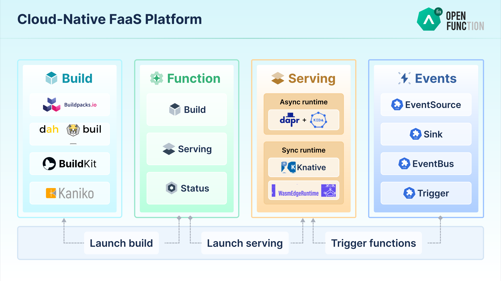

<b>Cloud native FaaS platform for running Serverless workloads with ease</b>

## 👀 Overview

[OpenFunction](https://openfunction.dev/) is a cloud-native open source FaaS (Function as a Service) platform aiming to let you focus on your business logic without having to maintain the underlying runtime environment and infrastructure. You only need to submit business-related source code in the form of functions.

OpenFunction features include:

- Cloud agnostic and decoupled with cloud providers' BaaS
- Pluggable architecture that allows multiple function runtimes
- Support both sync and async functions
- Unique async functions support that can consume events directly from event sources
- Support generating OCI-Compliant container images directly from function source code.
- Flexible autoscaling between 0 and N
- Advanced async function autoscaling based on event sources' specific metrics
- Simplified BaaS integration for both sync and async functions by introducing [Dapr](https://dapr.io/) 
- Advanced function ingress & traffic management powered by [K8s Gateway API](https://gateway-api.sigs.k8s.io/) (In Progress)
- Flexible and easy-to-use events management framework

## ☸ Architecture

OpenFunction manages resources in the form of Custom Resource Definitions (CRD) throughout the lifecycle of a function. To learn more about it, visit [Components](docs/concepts/Components.md) or [Concepts](https://openfunction.dev/docs/concepts/).

OpenFunction Events is OpenFunction's events framework, you can refer to [OpenFunction Events](https://github.com/OpenFunction/OpenFunction/blob/main/docs/concepts/OpenFunction-events-framework.md) for more information.
## ✔️ Compatibility

### Kubernetes compatibility matrix

The following Kubernetes versions are supported as we tested against these versions in their respective branches. Besides, OpenFunction might also work well with other Kubernetes versions!

| OpenFunction                                                 | Kubernetes 1.17 | Kubernetes 1.18 | Kubernetes 1.19 | Kubernetes 1.20+ |
| ------------------------------------------------------------ | --------------- | --------------- | --------------- | ---------------- |
| [`release-0.4`](https://github.com/OpenFunction/OpenFunction/tree/v0.4.0) | &radic;         | &radic;         | &radic;         | &radic;          |
| [`release-0.5`](https://github.com/OpenFunction/OpenFunction/tree/v0.5.0) | &radic; *         | &radic; *         | &radic;         | &radic;          |
| [`release-0.6`](https://github.com/OpenFunction/OpenFunction/tree/v0.6.0) | &radic; *         | &radic; *         | &radic;         | &radic;          |
| [`HEAD`](https://github.com/OpenFunction/OpenFunction/tree/main) | &radic; *         | &radic; *         | &radic;         | &radic;          |

\****Note***: OpenFunction has added the [function ingress](docs/concepts/Components.md#domain) feature in *release-0.5*, which means that:

- You have to install OpenFunction in Kuberenetes ***v1.19*** or later if you enable this feature.
- You can still use OpenFunction in Kubernetes ***v1.17—v1.20+*** without this feature enabled.

## 🚀 QuickStart

### Install OpenFunction

To install OpenFunction, please refer to [Installation Guide](https://openfunction.dev/docs/getting-started/installation/#install-openfunction).

### Create functions

You can find guides to create the sync and async functions in different languages [here](https://openfunction.dev/docs/getting-started/quickstarts/)

### Uninstall OpenFunction

To uninstall OpenFunction, please refer to [Uninstallation Guide](https://openfunction.dev/docs/getting-started/installation/#uninstall-openfunction).

### FAQ

When you encounter any problems when using OpenFunction, you can refer to the [FAQ](https://openfunction.dev/docs/reference/faq/) for help.

## 💻 Development

See the [Development Guide](docs/development/README.md) to get started with developing this project.

## 🛣️ Roadmap

Learn more about OpenFunction [roadmap](https://github.com/orgs/OpenFunction/projects/3/views/1?layout=board).

## 🏘️ Community

### Community Call and Events

Meeting time：15:00-16:00(GMT+08:00), Thursday every two weeks starting from March 17th, 2022

Meeting room: [Tencent Meeting](https://meeting.tencent.com/dm/HMec1CjT8F2i)

Tencent Meeting Number: 443-6181-3052

Check out the [meeting calendar](https://kubesphere.io/contribution/) and [meeting notes](https://docs.google.com/document/d/1bh5-kVPegjNlIjjq_e37mS3ZhyXWhmmUaysFgeI9_-o/edit?usp=sharing).

OpenFunction team has presented OpenFunction project in some community events including [CNCF TAG-runtime meeting](https://youtu.be/qDH_LbagrVA?t=821), [Dapr community meeting](https://youtu.be/S9e3ol7JCDA?t=183), and [OpenFunction community call](https://space.bilibili.com/438908638/channel/seriesdetail?sid=495452). You can watch the recording videos and ask us anything.
### Contact Us

OpenFunction is sponsored and open-sourced by the [KubeSphere](http://kubesphere.io/) Team and maintained by the OpenFunction community.

- Discord: https://discord.gg/hG3yc6uAyC
- Slack: Create an account at [#CNCF Slack](https://slack.cncf.io/) and then search `#openfunction` to join or click [#openfunction](https://cloud-native.slack.com/archives/C03ETDMD3LZ) to join if you already have an [#CNCF Slack](https://slack.cncf.io/) account.
- Wechat: join the OpenFunction user group by following the `kubesphere` WeChat subscription and then reply `openfunction`

## Landscape
 

  
&nbsp;&nbsp;&nbsp;&nbsp;
  
OpenFunction is a CNCF Sandbox project now which also enriches the <a href="https://landscape.cncf.io/serverless?license=apache-license-2-0">CNCF Cloud Native Landscape.
</a>

## 📊 Status

