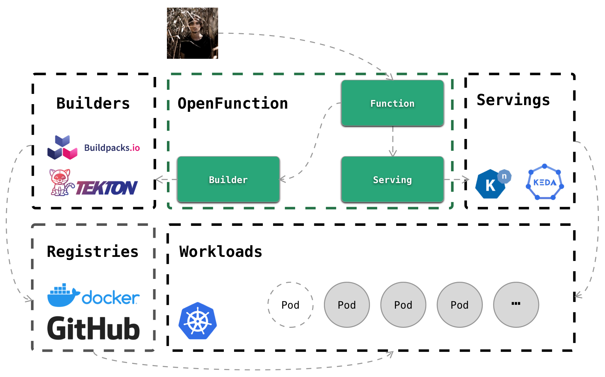

# 

## Overview

```OpenFunction``` is a cloud-native open source FaaS (Function as a Service) platform aiming to enable users to focus on their business logic without worrying about the underlying runtime environment and infrastructure. Users only need to submit business-related source code in the form of functions.

```OpenFunction``` features but not limited to the following:

- Convert business-related function source code to runnable application source code.
- Generate a deployable container image from the converted application source code.
- Deploy the generated container image to the underlying runtime environment such as K8s, and automatically scale up and down according to business traffic, and scale to 0 when there is no traffic.
- Provide event management functions for trigger functions.
- Provide additional functions to manage function versions, ingress management etc.



## CustomResourceDefinitions

The core function of OpenFunction is to enable users to develop, run, and manage business applications as execution units of code functions. OpenFunction implements the following [custom resource definitions (CRDs)](https://kubernetes.io/docs/tasks/access-kubernetes-api/extend-api-custom-resource-definitions/):  

- **Function**, defines a function.
- **Builder**, defines a function builder.
- **Serving**, defines a function workload.

### Function

The goal of Function is to control the lifecycle management from user code to the final application that can respond to events through a single profile.

Function will manage and coordinate Builder and Serving resources to handle the details of the process.

### Builder

The goal of Builder is to compile the user's function source code into an application image that can be run in a cloud-native environment.

It will fetch the code from the code repository, build the application image locally and publish it to the container image repository.

Currently, OpenFunction Builder uses [Tekton and Cloud Native Buildpacks](#tekton-and-cloud-native-buildpacks) to build container images.

#### Tekton and Cloud Native Buildpacks

Tekton is a CI/CD system that provides task pipelining capabilities. 

Cloud Native Buildpacks is an OCI standard image building framework that transform your application source code into images that can run on any cloud.

OpenFunction Builder controls the build process of application images by Tekton, including fetching code, building and publishing images via Cloud Native Buildpacks.

### Serving

The goal of Serving is to serving user functions and implementing event-driven functions response.

Currently, OpenFunction supports two serving runtimes, [Knative](#knative) and [OpenFuncAsync](#openfuncasync). At least one of these runtimes needs to be installed.

#### Knative

Knative Serving builds on Kubernetes to support deploying and serving serverless applications and functions. Knative Serving is easy to get started with and scales to support advanced scenarios.

#### OpenFuncAsync

OpenFuncAsync is an event-driven Serving runtime. It is implemented based on KEDA + Dapr.

You can refer to [Prerequisites](#prerequisites) and use `--with-openFuncAsync` to install OpenFuncAsync runtime.

The OpenFuncAsync runtime can be triggered by a variety of event types, such as MQ, cronjob, DB events, etc. In Kubernetes cluster, OpenFuncAsync will be triggered in the form of deployments or jobs.

## QuickStart

### Prerequisites

The current version of OpenFunction requires that you have a Kubernetes cluster with version ``>=1.18.6``.

In addition, you need to deploy several dependencies for the OpenFunction ```Builder``` and ```Serving```.

You can refer to the [Installation Guide](docs/installation/README.md) to setup OpenFunction ```Builder``` and ```Serving```, 
or use the following command to easily setup OpenFunction ```Builder``` and ```Serving```.

```shell
sh hack/deploy.sh --all
```

This command will install dependencies of all supported ```Builder``` and ```Serving``` to your cluster.

You can also customize the installation with the following parameters:

|Parameter|Comment|
|---|---|
| --all                              | Install all supported ```Builder``` and ```Serving``` |
| --with-tekton                      | Install Tekton builder |
| --with-knative                     | Install Knative serving runtime |
| --with-openFuncAsync               | Install OpenFuncAsync serving runtime |
| --poor-network                     | Use this when you having poor network connectivity to GitHub/Googleapis |
| --tekton-dashboard-nodeport <port> | Expose the Tekton dashboard service with nodeport |

### Install

You can install the OpenFunction platform by the following command:

- Install the latest stable version

```shell
kubectl apply -f https://github.com/OpenFunction/OpenFunction/releases/download/v0.2.0/bundle.yaml
```

- Install the development version

```shell
kubectl apply -f https://raw.githubusercontent.com/OpenFunction/OpenFunction/main/config/bundle.yaml
```

> Note: When using non-default namespaces, make sure that the ClusterRoleBinding in the namespace is adapted.

### Sample: Run a function.

If you have already installed the OpenFunction platform, refer to [OpenFunction samples](https://github.com/OpenFunction/samples) to run a sample function.

### Uninstall 

- Uninstall the latest stable version

```shell
kubectl delete -f https://raw.githubusercontent.com/OpenFunction/OpenFunction/main/config/bundle.yaml
```

- Uninstall the development version

```shell
kubectl delete -f https://raw.githubusercontent.com/OpenFunction/OpenFunction/release-0.2/config/bundle.yaml
```

## Development

You can get help on developing this project by visiting [Development Guide](docs/development/README.md).

## Roadmap

[Here](docs/roadmap.md) you can find OpenFunction's roadmap.

## Community

### Community Call

Meeting Info: [Zoom](https://us02web.zoom.us/j/87437196365?pwd=UndDL2puMXlqcSt5U3JaYUdRNk85Zz09) 

Meeting Time: Wednesday at 16:30~17:30 Beijing Time (biweekly, starting from June 23rd, 2021) [Meeting Calendar](https://kubesphere.io/contribution/)

[Meeting notes](https://docs.google.com/document/d/1bh5-kVPegjNlIjjq_e37mS3ZhyXWhmmUaysFgeI9_-o/edit?usp=sharing)

### Contact Us

- Slack [#sig-serverless](https://kubesphere.slack.com/archives/C021XAR3CG3)
