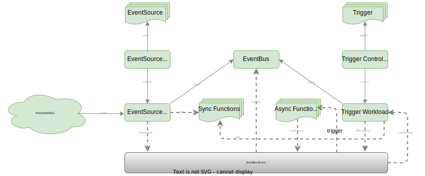

- [Overview](#overview)
  - [Features](#features)
- [Concepts](#concepts)
  - [Architecture](#architecture)
  - [EventSource](#eventsource)
    - [Available](#available)
  - [EventBus(ClusterEventBus)](#eventbusclustereventbus)
    - [Supported EventBus brokers](#supported-eventbus-brokers)
  - [Trigger](#trigger)
- [Getting Started](#getting-started)
  - [Sample 1: Event source trigger synchronization function](#sample-1-event-source-trigger-synchronization-function)
    - [Prerequisites](#prerequisites)
  - [Sample 2: Use of event bus and triggers](#sample-2-use-of-event-bus-and-triggers)
    - [Prerequisites](#prerequisites-1)
  - [Sample 3: Multi sources in one EventSource](#sample-3-multi-sources-in-one-eventsource)
  - [Sample 4: EventBus and ClusterEventBus](#sample-4-eventbus-and-clustereventbus)
  - [Sample 5: Use Trigger conditions](#sample-5-use-trigger-conditions)

# Overview

**OpenFunction Events** is the event management framework for OpenFunction.

## Features

- Support for triggering target functions by synchronous and asynchronous calls
- User-defined trigger judgment logic
- The components of OpenFunction Events can be driven by OpenFunction itself

# Concepts

## Architecture



## EventSource

Represents the producer of an event, such as a Kafka service, an object storage service, and can also be a function.

The **EventSource** contains descriptions of these event producers. It also contains information like where to send the events.

### Available

- Kafka
- Cron (scheduler)
- Redis
- MQTT

## EventBus(ClusterEventBus)

The event bus is responsible for aggregating events and persisting them.

The **EventBus** contains descriptions of an event bus broker (usually a message queue such as NATS Streaming, Kafka, etc.) and then provides these configurations for EventSource and Trigger.

EventBus will take care of event bus adaptation for namespaced scope by default, while we provide an event bus adapter **ClusterEventBus** for clustered scope. **ClusterEventBus** will take effect when other components do not find an EventBus under the namespace.

### Supported EventBus brokers

- NATS Streaming

## Trigger

An abstraction of the purpose of the event, such as what needs to be done when a message is received.

The **Trigger** contains the user's description of the purpose of the event, which guides the trigger on which event sources it should fetch the event from and subsequently determine whether to trigger the target function according to the given conditions

# Getting Started

## Sample 1: Event source trigger synchronization function

In this sample, the event source is a Kafka server and the target function is a Knative Service. We will define an EventSource for synchronous invocation, whose role is to use the event source (Kafka server) as an input bindings of function (Knative service) , and when the event source generates an event, it will invoke the function and get a synchronous return through the `EventSource.Sink` configuration.

### Prerequisites

- A Knative runtime function (target function)

  You can create a function like below as the EventSource Sink.

  ```yaml
  apiVersion: core.openfunction.io/v1beta1
  kind: Function
  metadata:
    name: sink
  spec:
    version: "v1.0.0"
    image: "openfunction/sink-sample:latest"
    port: 8080
    serving:
      runtime: "knative"
      template:
        containers:
          - name: function
            imagePullPolicy: Always
  ```

  You can get the URL address of the function with the following command:

  > Note that the `openfunction.io` is a Kubernetes Service name here.

  ```shell
  $ kubectl get functions.core.openfunction.io
  NAME   BUILDSTATE   SERVINGSTATE   BUILDER   SERVING         URL                                   AGE
  sink   Skipped      Running                  serving-4x5wh   http://openfunction.io/default/sink   13s
  ```

- A Kafka server (event source)

  You can refer to [Prerequisites - kafka](https://github.com/OpenFunction/samples/blob/main/Prerequisites.md#kafka) to deploy a Kafka server with the name `kafka-server` and the topic name `events-sample`.


Create an EventSource configuration `eventsource-sink.yaml` :

> We define an event source named "my-eventsource" and mark the events generated by the specified Kafka server as "sample-one" events.
>
> `EventSource.Sink` references the target function (Knative Service) we created above.

```yaml
apiVersion: events.openfunction.io/v1alpha1
kind: EventSource
metadata:
  name: my-eventsource
spec:
  logLevel: "2"
  kafka:
    sample-one:
      brokers: "kafka-server-kafka-brokers.default.svc.cluster.local:9092"
      topic: "events-sample"
      authRequired: false
  sink:
    uri: "http://openfunction.io.svc.cluster.local/default/sink"
```

Apply it :

```shell
$ kubectl apply -f eventsource-sink.yaml
```

You will observe the following changes:

> In the synchronous sample, the workflow of the EventSource controller is as follows :
>
> 1. Create the EventSource CR called "my-eventsource"
> 2. Create a Dapr Component named "serving-xxxxx-component-esc-kafka-sample-one-xxxxx" to enable the EventSource to associate with the event source.
> 3. Create a Dapr Component named "serving-xxxxx-component-ts-my-eventsource-default-xxxxx" to enable the EventSource to associate with the sink function.
> 4. Create a Deployments named "serving-xxxxx-deployment-v100-xxxxx-xxxxxxxxxx-xxxxx" for processing events

```shell
$ kubectl get eventsources.events.openfunction.io
NAME             EVENTBUS   SINK   STATUS
my-eventsource                     Ready

$ kubectl get components
NAME                                                      AGE
serving-8f6md-component-esc-kafka-sample-one-r527t        68m
serving-8f6md-component-ts-my-eventsource-default-wz8jt   68m

$ kubectl get deployments.apps
NAME                                           READY   UP-TO-DATE   AVAILABLE   AGE
serving-8f6md-deployment-v100-pg9sd            1/1     1            1           68m
```

At this point we see that the target function is not started (because there is no event input) and we can create some events to trigger the function.

Create an event producer `events-producer.yaml`:

```yaml
apiVersion: core.openfunction.io/v1beta1
kind: Function
metadata:
  name: events-producer
spec:
  version: "v1.0.0"
  image: openfunctiondev/v1beta1-bindings:latest
  serving:
    template:
      containers:
        - name: function
          imagePullPolicy: Always
    runtime: "async"
    inputs:
      - name: cron
        component: cron
    outputs:
      - name: target
        component: kafka-server
        operation: "create"
    bindings:
      cron:
        type: bindings.cron
        version: v1
        metadata:
          - name: schedule
            value: "@every 2s"
      kafka-server:
        type: bindings.kafka
        version: v1
        metadata:
          - name: brokers
            value: "kafka-server-kafka-brokers:9092"
          - name: topics
            value: "events-sample"
          - name: consumerGroup
            value: "bindings-with-output"
          - name: publishTopic
            value: "events-sample"
          - name: authRequired
            value: "false"
```

We can observe the change in Pod resources :

```shell
$ kubectl get po --watch
NAME                                                           READY   STATUS              RESTARTS   AGE
serving-k6zw8-deployment-v100-fbtdc-dc96c4589-s25dh            0/2     ContainerCreating   0          1s
serving-8f6md-deployment-v100-pg9sd-6666c5577f-4rpdg           2/2     Running             0          23m
serving-k6zw8-deployment-v100-fbtdc-dc96c4589-s25dh            0/2     ContainerCreating   0          1s
serving-k6zw8-deployment-v100-fbtdc-dc96c4589-s25dh            1/2     Running             0          5s
serving-k6zw8-deployment-v100-fbtdc-dc96c4589-s25dh            2/2     Running             0          8s
serving-4x5wh-ksvc-wxbf2-v100-deployment-5c495c84f6-8n6mk      0/2     Pending             0          0s
serving-4x5wh-ksvc-wxbf2-v100-deployment-5c495c84f6-8n6mk      0/2     Pending             0          0s
serving-4x5wh-ksvc-wxbf2-v100-deployment-5c495c84f6-8n6mk      0/2     ContainerCreating   0          0s
serving-4x5wh-ksvc-wxbf2-v100-deployment-5c495c84f6-8n6mk      0/2     ContainerCreating   0          2s
serving-4x5wh-ksvc-wxbf2-v100-deployment-5c495c84f6-8n6mk      1/2     Running             0          4s
serving-4x5wh-ksvc-wxbf2-v100-deployment-5c495c84f6-8n6mk      1/2     Running             0          4s
serving-4x5wh-ksvc-wxbf2-v100-deployment-5c495c84f6-8n6mk      2/2     Running             0          4s
```

## Sample 2: Use of event bus and triggers

### Prerequisites

- A Knative runtime function (target function)

  You can create a function like below as the target function to trigger:

  ```yaml
  apiVersion: core.openfunction.io/v1beta1
  kind: Function
  metadata:
    name: sink
  spec:
    version: "v1.0.0"
    image: "openfunction/sink-sample:latest"
    port: 8080
    serving:
      runtime: "knative"
      template:
        containers:
          - name: function
            imagePullPolicy: Always
  ```

  You can get the URL address of the function with the following command:

  > Note that the `openfunction.io` is a Kubernetes Service name here.

  ```shell
  $ kubectl get functions.core.openfunction.io
  NAME   BUILDSTATE   SERVINGSTATE   BUILDER   SERVING         URL                                   AGE
  sink   Skipped      Running                  serving-4x5wh   http://openfunction.io/default/sink   13s
  ```

- A Kafka server (event source)

  You can refer to [Prerequisites - kafka](https://github.com/OpenFunction/samples/blob/main/Prerequisites.md#kafka) to deploy a Kafka server with the name `kafka-server` and the topic name `events-sample`.

- A Nats streaming server (event bus)

  You can refer to [Deploy NATS Streaming on Kubernetes with Helm Charts](https://github.com/nats-io/k8s/tree/main/helm/charts/stan#tldr) to deploy a Nats streaming server.

  Here I assume that the access address of this NATS Streaming server is `nats://nats.default:4222` and the cluster ID is `stan`:

  ```shell
  helm repo add nats https://nats-io.github.io/k8s/helm/charts/
  helm install nats nats/nats
  helm install stan nats/stan --set stan.nats.url=nats://nats:4222
  ```

- An Async runtime function (target function)

  We create an Async function that is triggered by the Trigger and prints the received message:

  ```yaml
  apiVersion: core.openfunction.io/v1beta1
  kind: Function
  metadata:
    name: trigger-target
  spec:
    version: "v1.0.0"
    image: openfunctiondev/v1beta1-trigger-target:latest
    port: 8080
    serving:
      runtime: "async"
      scaleOptions:
        keda:
          scaledObject:
            pollingInterval: 15
            minReplicaCount: 0
            maxReplicaCount: 10
            cooldownPeriod: 30
      triggers:
        - type: stan
          metadata:
            natsServerMonitoringEndpoint: "stan.default.svc.cluster.local:8222"
            queueGroup: "grp1"
            durableName: "ImDurable"
            subject: "metrics"
            lagThreshold: "10"
      inputs:
        - name: autoscaling-pubsub
          component: eventbus
          topic: metrics
      pubsub:
        eventbus:
          type: pubsub.natsstreaming
          version: v1
          metadata:
            - name: natsURL
              value: "nats://nats.default:4222"
            - name: natsStreamingClusterID
              value: "stan"
            - name: subscriptionType
              value: "queue"
            - name: durableSubscriptionName
              value: "ImDurable"
            - name: consumerID
              value: "grp1"
  ```
  

Create an EventBus:

```yaml
apiVersion: events.openfunction.io/v1alpha1
kind: EventBus
metadata:
  name: default
spec:
  natsStreaming:
    natsURL: "nats://nats.default:4222"
    natsStreamingClusterID: "stan"
    subscriptionType: "queue"
    durableSubscriptionName: "ImDurable"
```

Create an EventSource:

>  We need to set the name of the event bus via `eventBus`

```yaml
apiVersion: events.openfunction.io/v1alpha1
kind: EventSource
metadata:
  name: my-eventsource
spec:
  logLevel: "2"
  eventBus: "default"
  kafka:
    sample-two:
      brokers: "kafka-server-kafka-brokers.default.svc.cluster.local:9092"
      topic: "events-sample"
      authRequired: false
```

You will observe the following changes:

> In the case of using the event bus, the workflow of the EventSource controller is as follows :
>
> 1. Create EventSource CR called "my-eventsource"
> 2. Retrieve and reorganize the configuration of the EventBus (used to pass in the Deployments in step 5), including:
     >    1. The EventBus name ("default" in this sample)
>    2. The name of the Dapr Component associated with the EventBus
> 3. Create a Dapr Component named "serving-xxxxx-component-ebfes-my-eventsource-xxxxx" to enable the EventSource to associate with the event bus.
> 4. Create a Dapr component named "serving-xxxxx-component-esc-kafka-sample-two-xxxxx" to enable the EventSource to associate with the event source.
> 5. Create a Deployments named "serving-xxxxx-deployment-v100-xxxxx" for processing events

```shell
$ kubectl get eventsources.events.openfunction.io
NAME             EVENTBUS   SINK   STATUS
my-eventsource   default           Ready

$ kubectl get eventbus.events.openfunction.io
NAME      AGE
default   6m53s

$ kubectl get components
NAME                                                 AGE
serving-6r5dl-component-eventbus-jlpqf               11m
serving-9689d-component-ebfes-my-eventsource-cmcbw   6m57s
serving-9689d-component-esc-kafka-sample-two-l99cg   6m57s
serving-k6zw8-component-cron-9x8hl                   61m
serving-k6zw8-component-kafka-server-sjrzs           61m

$ kubectl get deployments.apps
NAME                                       READY   UP-TO-DATE   AVAILABLE   AGE
serving-6r5dl-deployment-v100-m7nq2        0/0     0            0           12m
serving-9689d-deployment-v100-5qdvk        1/1     1            1           7m17s
```

At this point we also need a trigger to guide what the event should do.

Create a Trigger:

> Set the event bus associated with the Trigger via `spec.eventBus` .
>
> `spec.inputs` is used to set the event input source.
>
> Here we set up a very simple trigger that will collect events from the "default" EventBus. When it retrieves a "sample-two" event from the "my-eventsource" EventSource, it will trigger a Knative Service called "function-sample-serving-qrdx8-ksvc-fwml8" and send the event to the "metrics" topic of the event bus at the same time.

```yaml
apiVersion: events.openfunction.io/v1alpha1
kind: Trigger
metadata:
  name: my-trigger
spec:
  logLevel: "2"
  eventBus: "default"
  inputs:
    inputDemo:
      eventSource: "my-eventsource"
      event: "sample-two"
  subscribers:
    - condition: inputDemo
      topic: "metrics"
```

You will observe the following changes :

> In the case of using the event bus, the workflow of the Trigger controller is as follows :
>
> 1. Create a Trigger CR called "my-trigger"
> 2. Retrieve and reorganize the configuration of the EventBus (used to pass in the Deployments in step 5), including:
>    1. The EventBus name ("default" in this sample)
>    2. The name of the Dapr Component associated with the EventBus
> 3. Create a Dapr Component named "serving-xxxxx-component-ebft-my-trigger-xxxxx" to enable the Trigger to associatie with the event bus
> 5. Create a Deployments named "serving-xxxxx-deployment-v100-xxxxx" for processing trigger tasks

```shell
$ kubectl get triggers.events.openfunction.io
NAME         EVENTBUS   STATUS
my-trigger   default    Ready

$ kubectl get eventbus.events.openfunction.io
NAME      AGE
default   62m

$ kubectl get components
NAME                                                 AGE
serving-9689d-component-ebfes-my-eventsource-cmcbw   46m
serving-9689d-component-esc-kafka-sample-two-l99cg   46m
serving-dxrhd-component-eventbus-t65q7               13m
serving-zwlj4-component-ebft-my-trigger-4925n        100s
```

At this point we see that the target function is not started (because there is no event input) and we can create some events to trigger the function.

Create the events producer. (You can follow the step in Sample 1)

We can observe the changes of the async-target function:

```shell
$ kubectl get functions.core.openfunction.io
NAME                                  BUILDSTATE   SERVINGSTATE   BUILDER   SERVING         URL                                   AGE
trigger-target                        Skipped      Running                  serving-dxrhd                                         20m

$ kubectl get po --watch
NAME                                                     READY   STATUS              RESTARTS   AGE
serving-dxrhd-deployment-v100-xmrkq-785cb5f99-6hclm      0/2     Pending             0          0s
serving-dxrhd-deployment-v100-xmrkq-785cb5f99-6hclm      0/2     Pending             0          0s
serving-dxrhd-deployment-v100-xmrkq-785cb5f99-6hclm      0/2     ContainerCreating   0          0s
serving-dxrhd-deployment-v100-xmrkq-785cb5f99-6hclm      0/2     ContainerCreating   0          2s
serving-dxrhd-deployment-v100-xmrkq-785cb5f99-6hclm      1/2     Running             0          4s
serving-dxrhd-deployment-v100-xmrkq-785cb5f99-6hclm      1/2     Running             0          4s
serving-dxrhd-deployment-v100-xmrkq-785cb5f99-6hclm      2/2     Running             0          4s
```

## Sample 3: Multi sources in one EventSource

We add an event source configuration to the EventSource based on [Sample 1](#sample-1-event-source-trigger-synchronization-function) .

Create an EventSource:

> We define an event source named "my-eventsource" and mark the events generated by the specified Kafka server as "sample-three" events.
>
> `EventSource.Sink` references the target function (Knative Service) we created above.

```yaml
apiVersion: events.openfunction.io/v1alpha1
kind: EventSource
metadata:
  name: my-eventsource
spec:
  logLevel: "2"
  kafka:
    sample-three:
      brokers: "kafka-server-kafka-brokers.default.svc.cluster.local:9092"
      topic: "events-sample"
      authRequired: false
  cron:
    sample-three:
      schedule: "@every 5s" 
  sink:
    uri: "http://openfunction.io.svc.cluster.local/default/sink"
```

You will observe the following changes:

```shell
$ kubectl get eventsources.events.openfunction.io
NAME             EVENTBUS   SINK   STATUS
my-eventsource                     Ready

$ kubectl get components
NAME                                                      AGE
serving-vqfk5-component-esc-cron-sample-three-dzcpv       35s
serving-vqfk5-component-esc-kafka-sample-one-nr9pq        35s
serving-vqfk5-component-ts-my-eventsource-default-q6g6m   35s

$ kubectl get deployments.apps
NAME                                       READY   UP-TO-DATE   AVAILABLE   AGE
serving-4x5wh-ksvc-wxbf2-v100-deployment   1/1     1            1           3h14m
serving-vqfk5-deployment-v100-vdmvj        1/1     1            1           48s
```

The role of the `cron` event is to trigger the function in sink every 5 seconds.

## Sample 4: EventBus and ClusterEventBus

Based on [Sample 2](#sample-2-use-of-event-bus-and-triggers), we try to use a ClusterEventBus instead of an EventBus in the namespace.

Create a ClusterEventBus:

```yaml
apiVersion: events.openfunction.io/v1alpha1
kind: ClusterEventBus
metadata:
  name: default
spec:
  natsStreaming:
    natsURL: "nats://nats.default:4222"
    natsStreamingClusterID: "stan"
    subscriptionType: "queue"
    durableSubscriptionName: "ImDurable"
```

Delete EventBus:

```shell
$ kubectl delete eventbus.events.openfunction.io default
```

Then apply the ClusterEventBus. You will observe the following changes:

```shell
$ kubectl get eventbus.events.openfunction.io
No resources found in default namespace.

$ kubectl get clustereventbus.events.openfunction.io
NAME      AGE
default   21s
```

If there are no other changes, you can see that the event bus is still working properly in the whole sample.

## Sample 5: Use Trigger conditions

Based on [Sample 2](#sample-2-use-of-event-bus-and-triggers), we use condition to control the triggering of events.

Define two event sources:

- eventsource-a

  ```yaml
  apiVersion: events.openfunction.io/v1alpha1
  kind: EventSource
  metadata:
    name: eventsource-a
  spec:
    logLevel: "2"
    eventBus: "default"
    kafka:
      sample-five:
        brokers: "kafka-server-kafka-brokers.default.svc.cluster.local:9092"
        topic: "events-sample"
        authRequired: false
  ```

- eventsource-b

  ```yaml
  apiVersion: events.openfunction.io/v1alpha1
  kind: EventSource
  metadata:
    name: eventsource-b
  spec:
    logLevel: "2"
    eventBus: "default"
    cron:
      sample-five:
        schedule: "@every 5s" 
  ```

Create a trigger with condition:

> Note that we have set up two input sources and two subscribers, and their triggering relationship is as follows.
>
> - When input eventB is received, the input event is sent to the knative service
>
> - When input eventB and input eventA are received, the input event is sent to the metrics topic of the event bus (The above step is also effective)

```yaml
apiVersion: events.openfunction.io/v1alpha1
kind: Trigger
metadata:
  name: condition-trigger
spec:
  logLevel: "2"
  eventBus: "default"
  inputs:
    eventA:
      eventSource: "eventsource-a"
      event: "sample-five"
    eventB:
      eventSource: "eventsource-b"
      event: "sample-five"
  subscribers:
  - condition: eventB
    sink:
      uri: "http://openfunction.io.svc.cluster.local/default/sink"
  - condition: eventA && eventB
    topic: "metrics"
```

You will observe the following changes:

```shell
$ kubectl get eventsources.events.openfunction.io
NAME            EVENTBUS   SINK   STATUS
eventsource-a   default           Ready
eventsource-b   default           Ready

$ kubectl get triggers.events.openfunction.io
NAME                EVENTBUS   STATUS
condition-trigger   default    Ready

$ kubectl get eventbus.events.openfunction.io
NAME      AGE
default   12s
```

Since the event source **eventsource-b** is a cron task, the **condition: eventB** in the Trigger has been matched and the Knative Service has been triggered.

```shell
$ kubectl get functions.core.openfunction.io
NAME                                  BUILDSTATE   SERVINGSTATE   BUILDER   SERVING         URL                                   AGE
sink                                  Skipped      Running                  serving-4x5wh   http://openfunction.io/default/sink   3h25m

$ kubectl get po
NAME                                                        READY   STATUS    RESTARTS   AGE
serving-4x5wh-ksvc-wxbf2-v100-deployment-5c495c84f6-k2jdg   2/2     Running   0          46s
```

We then create the events producer.

At this point the **condition: eventA && eventB** in the Trigger has been matched and the event is sent to the "metrics" topic of the event bus at the same time. The Async function will be triggered:

```shell
$ kubectl get functions.core.openfunction.io
NAME                                  BUILDSTATE   SERVINGSTATE   BUILDER   SERVING         URL                                   AGE
trigger-target                        Skipped      Running                  serving-7hghp                                         103s

$ kubectl get po
NAME                                                        READY   STATUS    RESTARTS   AGE
serving-7hghp-deployment-v100-z8wrf-946b4854d-svf55         2/2     Running   0          18s
```
