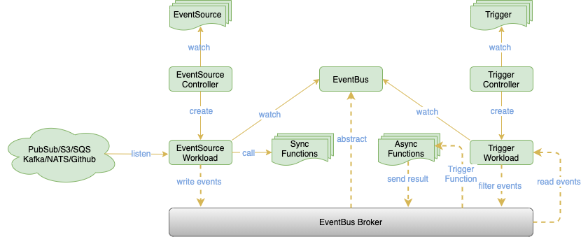

- [Overview](#overview)
  * [Features](#features)
- [Concepts](#concepts)
  * [Architecture](#architecture)
  * [EventSource](#eventsource)
  * [EventBus(ClusterEventBus)](#eventbusclustereventbus)
  * [Trigger](#trigger)
- [Getting Started](#getting-started)
  * [Sample 1: Event source trigger synchronization function](#sample-1-event-source-trigger-synchronization-function)
  * [Sample 2: Use of event bus and triggers](#sample-2-use-of-event-bus-and-triggers)
  * [Sample 3: Multi sources in one EventSource](#sample-3-multi-sources-in-one-eventsource)
  * [Sample 4: EventBus and ClusterEventBus](#sample-4-eventbus-and-clustereventbus)
  * [Sample 5: Use Trigger conditions](#sample-5-use-trigger-conditions)

# Overview

**OpenFunction Events** is the event management framework for OpenFunction.

## Features

- Support for triggering target functions by synchronous and asynchronous calls
- User-defined trigger judgment logic
- The components of OpenFunction Events can be driven by OpenFunction itself

# Concepts

## Architecture



## EventSource

Represents the producer of an event, such as a Kafka service, an object storage service, and can also be a function.

The **EventSource** contains descriptions of these event producers. It also contains information like where to send the events.

### Available

- Kafka
- Cron (scheduler)
- Redis

## EventBus(ClusterEventBus)

The event bus is responsible for aggregating events and persisting them.

The **EventBus** contains descriptions of an event bus broker (usually a message queue such as NATS Streaming, Kafka, etc.) and then provides these configurations for EventSource and Trigger.

EventBus will take care of event bus adaptation for namespaced scope by default, while we provide an event bus adapter **ClusterEventBus** for clustered scope. **ClusterEventBus** will take effect when other components do not find an EventBus under the namespace.

### Supported EventBus brokers

- NATS Streaming

## Trigger

An abstraction of the purpose of the event, such as what needs to be done when a message is received.

The **Trigger** contains the user's description of the purpose of the event, which guides the trigger on which event sources it should fetch the event from and subsequently determine whether to trigger the target function according to the given conditions

# Getting Started

## Sample 1: Event source trigger synchronization function

In this sample, the event source is a Kafka server and the target function is a Knative Service. We will define an EventSource for synchronous invocation, whose role is to use the event source (Kafka server) as an input bindings of function (Knative service) , and when the event source generates an event, it will invoke the function and get a synchronous return through the `EventSource.Sink` configuration.

### Prerequisites

- A Knative runtime function (target function)

  You can refer to [Sample Function Go](https://github.com/OpenFunction/samples/tree/main/functions/Knative/hello-world-go) to create a Knative runtime function.

  Here I assume that the name of this function (Knative Service) is `function-sample-serving-qrdx8-ksvc-fwml8` . You should be able to see this value with the `kubectl get ksvc` command

- A Kafka server (event source)

  You can refer to [Setting up a Kafka in Kubernetes](https://github.com/dapr/quickstarts/tree/master/bindings#setting-up-a-kafka-in-kubernetes) to deploy a Kafka server.

  Here I assume that the access address of this Kafka server is `dapr-kafka.kafka:9092` .

Create an EventSource configuration `eventsource-sink.yaml` :

> We define an event source named "my-eventsource" and mark the events producered by the specified Kafka server as "sample-one".
>
> `EventSource.Sink` references the target function (Knative Service) we created above.

```yaml
apiVersion: events.openfunction.io/v1alpha1
kind: EventSource
metadata:
  name: my-eventsource
spec:
  kafka:
    sample-one:
      brokers: dapr-kafka.kafka:9092
      topic: sample
      authRequired: false
  sink:
    ref:
      apiVersion: serving.knative.dev/v1
      kind: Service
      name: function-sample-serving-qrdx8-ksvc-fwml8
      namespace: default
```

Apply it :

```shell
kubectl apply -f eventsource-sink.yaml
```

You will observe the following changes:

> In the synchronous sample, the workflow of the EventSource controller is as follows :
>
> 1. Create the EventSource CR called "my-eventsource"
> 2. Create a Dapr Component called "eventsource-my-eventsource-kafka-sample-one" for associating the event source
> 3. Create a Dapr Component called "eventsource-sink-my-eventsource" for associating the target function
> 4. Create a Deployments called "eventsource-my-eventsource-kafka-sample-one" for processing events

```shell
~# kubectl get eventsources.events.openfunction.io
NAME             EVENTBUS   SINK
my-eventsource              function-sample-serving-ksvc

~# kubectl get components
NAME                                          AGE
eventsource-my-eventsource-kafka-sample-one   3m45s
eventsource-sink-my-eventsource               3m45s

~# kubectl get deployments.apps
NAME                                           READY   UP-TO-DATE   AVAILABLE   AGE
eventsource-my-eventsource-kafka-sample-one    1/1     1            1           4m14s
```

At this point we see that the target function is not started (because there is no event input) and we can create some events to trigger the function.

Create an event producer `events-producer.yaml` :

> You can choose the producer image `openfunctiondev/events-producer:latest`, which will publish events to the event source at a rate of one event per 5 seconds.
>
> And if you are using this image as an event producer, then you need to set an environment variable that sets the value of `TARGET_NAME` to the name of the dapr component of the EventSource deployed above, i.e. `eventsource-my-eventsource-kafka-sample-one` .

```yaml
apiVersion: apps/v1
kind: Deployment
metadata:
  name: events-producer
  labels:
    app: eventsproducer
spec:
  replicas: 1
  selector:
    matchLabels:
      app: eventsproducer
  template:
    metadata:
      labels:
        app: eventsproducer
      annotations:
        dapr.io/enabled: "true"
        dapr.io/app-id: "events-producer"
        dapr.io/log-as-json: "true"
    spec:
      containers:
        - name: producer
          image: openfunctiondev/events-producer:latest
          imagePullPolicy: Always
          env:
            - name: TARGET_NAME
              value: "eventsource-my-eventsource-kafka-sample-one"
```

Apply it :

```shell
kubectl apply -f events-producer.yaml
```

We can observe the change in Pod resources :

```shell
~# kubectl get po --watch
NAME                                                           READY   STATUS              RESTARTS   AGE
events-producer-86b49654-8stj6                                 0/2     ContainerCreating   0          1s
eventsource-my-eventsource-kafka-sample-one-789b767c79-45bdf   2/2     Running             0          23m
events-producer-86b49654-8stj6                                 0/2     ContainerCreating   0          1s
events-producer-86b49654-8stj6                                 1/2     Running             0          5s
events-producer-86b49654-8stj6                                 2/2     Running             0          8s
function-sample-serving-qrdx8-ksvc-fwml8-v100-deployment-8cpxsj   0/2     Pending             0          0s
function-sample-serving-qrdx8-ksvc-fwml8-v100-deployment-8cpxsj   0/2     Pending             0          0s
function-sample-serving-qrdx8-ksvc-fwml8-v100-deployment-8cpxsj   0/2     ContainerCreating   0          0s
function-sample-serving-qrdx8-ksvc-fwml8-v100-deployment-8cpxsj   0/2     ContainerCreating   0          2s
function-sample-serving-qrdx8-ksvc-fwml8-v100-deployment-8cpxsj   1/2     Running             0          4s
function-sample-serving-qrdx8-ksvc-fwml8-v100-deployment-8cpxsj   1/2     Running             0          4s
function-sample-serving-qrdx8-ksvc-fwml8-v100-deployment-8cpxsj   2/2     Running             0          4s
```

## Sample 2: Use of event bus and triggers

### Prerequisites

- A Knative runtime function (target function)

  You can refer to [Sample Function Go](https://github.com/OpenFunction/samples/tree/main/functions/Knative/hello-world-go) to create a Knative runtime function.

  Here I assume that the name of this function (Knative Service) is `function-sample-serving-ksvc` . You should be able to see this value with the `kubectl get ksvc` command

- A Kafka server (event source)

  You can refer to [Setting up a Kafka in Kubernetes](https://github.com/dapr/quickstarts/tree/master/bindings#setting-up-a-kafka-in-kubernetes) to deploy a Kafka server.

  Here I assume that the access address of this Kafka server is `dapr-kafka.kafka:9092` .

- A Nats streaming server (event bus)

  You can refer to [Deploy NATS on Kubernetes with Helm Charts](https://nats-io.github.io/k8s/) to deploy a Nats streaming server.

  Here I assume that the access address of this NATS Streaming server is `nats://nats.default:4222` and the cluster ID is `stan` .

- A OpenFuncAsync runtime function (target function)

  We create a function `openfuncasync-function.yaml`, which serves to print the received message

  > You can set **spec.imageCredentials** by referring to [pubsub sample](https://github.com/OpenFunction/samples/tree/main/functions/OpenFuncAsync/pubsub)
  >
  > You need to change **spec.image** to your dockerhub address

  ```yaml
  apiVersion: core.openfunction.io/v1alpha1
  kind: Function
  metadata:
    name: autoscaling-subscriber
  spec:
    version: "v1.0.0"
    image: <your dockerhub id>/autoscaling-subscriber:latest
    imageCredentials:
      name: push-secret
    build:
      builder: openfunctiondev/go115-builder:v0.2.0
      env:
        FUNC_NAME: "Subscriber"
      srcRepo:
        url: "https://github.com/OpenFunction/samples.git"
        sourceSubPath: "functions/OpenFuncAsync/pubsub/subscriber"
    serving:
      runtime: "OpenFuncAsync"
      openFuncAsync:
        dapr:
          inputs:
            - name: autoscaling-pubsub
              type: pubsub
              topic: metrics
          annotations:
            dapr.io/log-level: "debug"
          components:
            - name: autoscaling-pubsub
              type: pubsub.natsstreaming
              version: v1
              metadata:
                - name: natsURL
                  value: "nats://nats.default:4222"
                - name: natsStreamingClusterID
                  value: "stan"
                - name: subscriptionType
                  value: "queue"
                - name: durableSubscriptionName
                  value: "ImDurable"
                - name: consumerID
                  value: "grp1"
        keda:
          scaledObject:
            pollingInterval: 15
            minReplicaCount: 0
            maxReplicaCount: 10
            cooldownPeriod: 30
            triggers:
              - type: stan
                metadata:
                  natsServerMonitoringEndpoint: "stan-0.stan.default.svc.cluster.local:8222"
                  queueGroup: "grp1"
                  durableName: "ImDurable"
                  subject: "metrics"
                  lagThreshold: "10"
  ```

  Apply it:

  ```shell
  kubectl apply -f openfuncasync-function.yaml
  ```

Create an EventBus configuration `eventbus-default.yaml` ：

```yaml
apiVersion: events.openfunction.io/v1alpha1
kind: EventBus
metadata:
  name: default
spec:
  natsStreaming:
    natsURL: "nats://nats.default:4222"
    natsStreamingClusterID: "stan"
    subscriptionType: queue
```

Create an EventSource configuration `eventsource-eventbus.yaml` ：

>  We need to set the name of the event bus via `eventBus`

```yaml
apiVersion: events.openfunction.io/v1alpha1
kind: EventSource
metadata:
  name: my-eventsource
spec:
  eventBus: "default"
  kafka:
    sample-two:
      brokers: dapr-kafka.kafka:9092
      topic: sample
      authRequired: false
```

Apply them :

```shell
kubectl apply -f eventbus-default.yaml
kubectl apply -f eventsource-eventbus.yaml
```

You will observe the following changes:

> In the case of using the event bus, the workflow of the EventSource controller is as follows :
>
> 1. Create EventSource CR called "my-eventsource"
> 2. Retrieve and reorganize the configuration of the EventBus (used to pass in the Deployments in step 5), including:
     >    1. The EventBus name ("default" in this sample)
>    2. The name of the Dapr Component associated with the EventBus ("eventsource-eventbus-my-eventsource" in this sample)
> 3. Create a Dapr Component called "eventsource-eventbus-my-eventsource" for associating the event bus
> 4. Create a Dapr Component called "eventsource-my-eventsource-kafka-sample-two" for associating the event source
> 5. Create a Deployments called "eventsource-my-eventsource-kafka-sample-two" for processing events

```shell
~# kubectl get eventsources.events.openfunction.io
NAME             EVENTBUS   SINK
my-eventsource   default

~# kubectl get eventbus.events.openfunction.io
NAME      AGE
default   10m

~# kubectl get components
NAME                                          AGE
eventsource-eventbus-my-eventsource           28s
eventsource-my-eventsource-kafka-sample-two   28s

~# kubectl get deployments.apps
NAME                                           READY   UP-TO-DATE   AVAILABLE   AGE
eventsource-my-eventsource-kafka-sample-two    1/1     1            1           4m53s
```

At this point we also need a trigger to guide what the event should do.

Create a Trigger configuration `trigger.yaml` :

> Set the event bus associated with the Trigger via `spec.eventBus` .
>
> `spec.inputs` is used to set the event input source.
>
> Here we set up a very simple trigger that will collect events from the "default" EventBus. When it retrieves a "sample-two" event from the "my-eventsource" EventSource, it will trigger a Knative Service called "function-sample-serving-qrdx8-ksvc-fwml8" and send the event to the "metrics" topic of the event bus at the same time.

```yaml
apiVersion: events.openfunction.io/v1alpha1
kind: Trigger
metadata:
  name: my-trigger
spec:
  eventBus: "default"
  inputs:
    inputDemo:
      eventSource: "my-eventsource"
      event: "sample-two"
  subscribers:
  - condition: inputDemo
    sink:
      ref:
        apiVersion: serving.knative.dev/v1
        kind: Service
        name: function-sample-serving-qrdx8-ksvc-fwml8
        namespace: default
    topic: "metrics"
```

Apply it :

```yaml
kubectl apply -f trigger.yaml
```

You will observe the following changes :

> In the case of using the event bus, the workflow of the Trigger controller is as follows :
>
> 1. Create a Trigger CR called "my-trigger"
> 2. Retrieve and reorganize the configuration of the EventBus (used to pass in the Deployments in step 5), including:
>    1. The EventBus name ("default" in this sample)
>    2. The name of the Dapr Component associated with the EventBus ("eventbus-trigger-my-trigger" in this sample)
> 3. Create a Dapr Component called "eventbus-trigger-my-trigger " for associating the event bus
> 4. Create a Dapr Component called "trigger-sink-my-trigger-default-function-sample-serving-qrdx8-ksvc-fwml8" for associating the target Knative function
> 5. Create a Deployments called "trigger-my-trigger" for processing trigger tasks

```shell
~# kubectl get triggers.events.openfunction.io
NAME         AGE
my-trigger   34m

~# kubectl get eventbus.events.openfunction.io
NAME      AGE
default   62m

~# kubectl get components
autoscaling-pubsub                                                         90m
eventbus-eventsource-my-eventsource                                        161m
eventbus-trigger-my-trigger                                                161m
eventsource-my-eventsource-kafka-sample-two                                161m
trigger-sink-my-trigger-default-function-sample-serving-qrdx8-ksvc-fwml8   161m

~# kubectl get deployments.apps
NAME                    READY   UP-TO-DATE   AVAILABLE   AGE
trigger-my-trigger      1/1     1            1           2m52s
```

At this point we see that the target function is not started (because there is no event input) and we can create some events to trigger the function.

Create an event producer `events-producer.yaml` :

> You can choose the producer image `openfunctiondev/events-producer:latest`, which will publish events to the event source at a rate of one event per 5 seconds.
>
> And if you are using this image as an event producer, then you need to set an environment variable that sets the value of `TARGET_NAME` to the name of the dapr component of the EventSource deployed above, i.e. `eventsource-my-eventsource-kafka-sample-two` .

```yaml
apiVersion: apps/v1
kind: Deployment
metadata:
  name: events-producer
  labels:
    app: eventsproducer
spec:
  replicas: 1
  selector:
    matchLabels:
      app: eventsproducer
  template:
    metadata:
      labels:
        app: eventsproducer
      annotations:
        dapr.io/enabled: "true"
        dapr.io/app-id: "events-producer"
        dapr.io/log-as-json: "true"
    spec:
      containers:
        - name: producer
          image: openfunctiondev/events-producer:latest
          imagePullPolicy: Always
          env:
            - name: TARGET_NAME
              value: "eventsource-my-eventsource-kafka-sample-two"
```

Apply it :

```shell
kubectl apply -f events-producer.yaml
```

We can observe the change in Pod resources :

```shell
~# kubectl get po --watch
NAME                                                           READY   STATUS              RESTARTS   AGE
events-producer-86679d99fb-4tlbt                               0/2     ContainerCreating   0          2s
eventsource-my-eventsource-kafka-sample-two-7695c6cfdd-j2g5b   2/2     Running             0          58m
trigger-my-trigger-7b799c7f7d-4ph77                            2/2     Running             0          37m
events-producer-86679d99fb-4tlbt                               0/2     ContainerCreating   0          2s
events-producer-86679d99fb-4tlbt                               1/2     Running             0          6s
events-producer-86679d99fb-4tlbt                               2/2     Running             0          10s
function-sample-serving-qrdx8-ksvc-fwml8-v100-deployment-8cpxsj   0/2     Pending             0          0s
function-sample-serving-qrdx8-ksvc-fwml8-v100-deployment-8cpxsj   0/2     Pending             0          0s
function-sample-serving-qrdx8-ksvc-fwml8-v100-deployment-8cpxsj   0/2     ContainerCreating   0          0s
function-sample-serving-qrdx8-ksvc-fwml8-v100-deployment-8cpxsj   0/2     ContainerCreating   0          2s
function-sample-serving-qrdx8-ksvc-fwml8-v100-deployment-8cpxsj   1/2     Running             0          3s
function-sample-serving-qrdx8-ksvc-fwml8-v100-deployment-8cpxsj   1/2     Running             0          4s
function-sample-serving-qrdx8-ksvc-fwml8-v100-deployment-8cpxsj   2/2     Running             0          4s
autoscaling-subscriber-serving-5qzlq-v100-xp9dw-77bc8cc88d8bf6m   0/2     Pending             0          0s
autoscaling-subscriber-serving-5qzlq-v100-xp9dw-77bc8cc88d8bf6m   0/2     Pending             0          0s
autoscaling-subscriber-serving-5qzlq-v100-xp9dw-77bc8cc88d8bf6m   0/2     ContainerCreating   0          0s
autoscaling-subscriber-serving-5qzlq-v100-xp9dw-77bc8cc88d8bf6m   0/2     ContainerCreating   0          1s
autoscaling-subscriber-serving-5qzlq-v100-xp9dw-77bc8cc88d8bf6m   1/2     Running             0          3s
autoscaling-subscriber-serving-5qzlq-v100-xp9dw-77bc8cc88d8bf6m   2/2     Running             0          11s
```

## Sample 3: Multi sources in one EventSource

We add an event source configuration to the EventSource based on [Sample 1](#sample-1-event-source-trigger-synchronization-function) .

Create an EventSource configuration `eventsource-multi.yaml` :

> We define an event source named "my-eventsource" and mark the events producered by the specified Kafka server as "sample-one".
>
> `EventSource.Sink` references the target function (Knative Service) we created above.

```yaml
apiVersion: events.openfunction.io/v1alpha1
kind: EventSource
metadata:
  name: my-eventsource
spec:
  kafka:
    sample-three:
      brokers: dapr-kafka.kafka:9092
      topic: sample
      consumerGroup: group1
      authRequired: false
  cron:
    sample-three:
      schedule: "@every 5s" 
  sink:
    ref:
      apiVersion: serving.knative.dev/v1
      kind: Service
      name: function-sample-serving-x6qjw-ksvc-x72j7
      namespace: default
```

Apply it :

```shell
kubectl apply -f eventsource-multi.yaml
```

You will observe the following changes:

```shell
~# kubectl get eventsources.events.openfunction.io
NAME             EVENTBUS   SINK
my-eventsource              function-sample-serving-ksvc

~# kubectl get components
NAME                                            AGE
eventsource-my-eventsource-cron-sample-three    96s
eventsource-my-eventsource-kafka-sample-three   96s
eventsource-sink-my-eventsource                 96s

~# kubectl get deployments.apps
NAME                                            READY   UP-TO-DATE   AVAILABLE   AGE
eventsource-my-eventsource-cron-sample-three    1/1     1            1           109s
eventsource-my-eventsource-kafka-sample-three   1/1     1            1           109s
```

The role of the `cron` event is to trigger the function in sink every 5 seconds.

## Sample 4: EventBus and ClusterEventBus

Based on [Sample 2](#sample-2-use-of-event-bus-and-triggers), we try to use a ClusterEventBus instead of an EventBus in the namespace.

Create a ClusterEventBus configuration `clustereventbus-default.yaml` ：

```yaml
apiVersion: events.openfunction.io/v1alpha1
kind: ClusterEventBus
metadata:
  name: default
spec:
  natsStreaming:
    natsURL: "nats://nats.default:4222"
    natsStreamingClusterID: "stan"
    subscriptionType: queue
```

Delete EventBus:

```shell
kubectl delete eventbus.events.openfunction.io default
```

And apply ClusterEventBus:

```shell
kubectl apply -f clustereventbus-default.yaml
```

You will observe the following changes:

```shell
~# kubectl get eventbus.events.openfunction.io
No resources found in default namespace.

~# kubectl get clustereventbus.events.openfunction.io
NAME      AGE
default   21s
```

If there are no other changes, you can see that the event bus is still working properly in the whole sample.

## Sample 5: Use Trigger conditions

Based on [Sample 2](#sample-2-use-of-event-bus-and-triggers), we use condition to control the triggering of events.

Define two event sources:

A kafka event source called `eventsource-a.yaml`:

```yaml
apiVersion: events.openfunction.io/v1alpha1
kind: EventSource
metadata:
  name: eventsource-a
spec:
  eventBus: "default"
  kafka:
    sample-five:
      brokers: dapr-kafka.kafka:9092
      topic: sample
      authRequired: false
```

And a cron schedule event source called `eventsource-b.yaml`:

```yaml
apiVersion: events.openfunction.io/v1alpha1
kind: EventSource
metadata:
  name: eventsource-b
spec:
  eventBus: "default"
  cron:
    sample-five:
      schedule: "@every 5s" 
```

Create a trigger with condition called `condition-trigger.yaml` :

> Note that we have set up two input sources and two subscribers, and their triggering relationship is as follows.
>
> - When input eventB is received, the input event is sent to the knative service
>
> - When input eventB and input eventA are received, the input event is sent to the metrics topic of the event bus (The above step is also effective)

```yaml
apiVersion: events.openfunction.io/v1alpha1
kind: Trigger
metadata:
  name: condition-trigger
spec:
  eventBus: "default"
  inputs:
    eventA:
      eventSource: "eventsource-a"
      event: "sample-five"
    eventB:
      eventSource: "eventsource-b"
      event: "sample-five"
  subscribers:
  - condition: eventB
    sink:
      ref:
        apiVersion: serving.knative.dev/v1
        kind: Service
        name: function-sample-serving-qrdx8-ksvc-fwml8
        namespace: default
  - condition: eventA && eventB
    topic: "metrics"
```

Apply them:

```shell
kubectl apply -f eventsource-a.yaml
kubectl apply -f eventsource-b.yaml
kubectl apply -f condition-trigger.yaml
```

You will observe the following changes:

```shell
~# kubectl get eventsources.events.openfunction.io
NAME            EVENTBUS   SINK   STATUS    COMPONENTS   WORKLOADS
eventsource-a   default           Running   2/2          1/1
eventsource-b   default           Running   2/2          1/1

~# kubectl get triggers.events.openfunction.io
NAME                EVENTBUS   STATUS    COMPONENTS   WORKLOADS
condition-trigger   default    Running   2/2          1/1

~# kubectl get eventbus.events.openfunction.io
NAME      AGE
default   12s
```

Since the event source **eventsource-b** is a cron task, the **condition: eventB** in the Trigger has been matched and the Knative Service has been triggered.

```shell
~# kubectl get po
NAME                                                              READY   STATUS    RESTARTS   AGE
function-sample-serving-qrdx8-ksvc-fwml8-v100-deployment-7n4kpd   2/2     Running   0          11m
```

We then create an event producer.

> Modity the **TARGET_NAME** to "eventsource-eventsource-a-kafka-sample-five"

```shell
kubectl apply -f events-producer.yaml
```

At this point the **condition: eventA && eventB** in the Trigger has been matched and the event is sent to the "metrics" topic of the event bus at the same time. The OpenFuncAsync function will be triggered:

```shell
~# kubectl get po
NAME                                                              READY   STATUS    RESTARTS   AGE
autoscaling-subscriber-serving-5qzlq-v100-xp9dw-77bc8cc88dts99v   2/2     Running   0          6s
```
