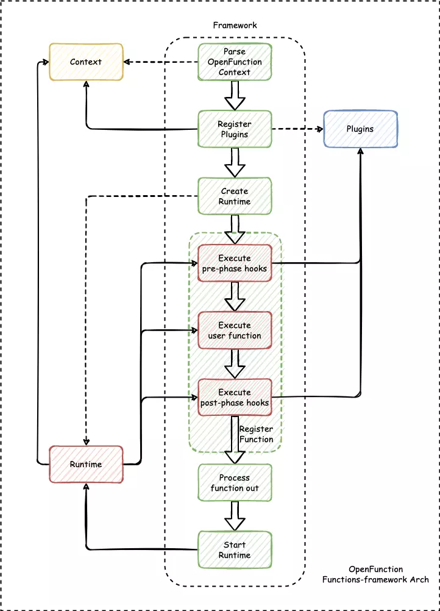

## Motivation

In the previous [proposal](https://github.com/OpenFunction/OpenFunction/blob/main/docs/proposals/202105_add_function_framework.md), we proposed to introduce a framework for OpenFunction to convert "functions" to "applications" - the **functions-framework**. The **functions-framework** did this well in OpenFunction *v0.4.0* and earlier.

However, we need to add some necessary capabilities to function because OpenFunction is evolving and the demand from the community is increasing. We can use functions-framework to implement most of these new features, thanks to the uniqueness of functions-framework in the lifecycle of OpenFunction.

Function tracing capabilities are very typical of these features.

We need to add observability to function, which helps to observe and track the operation of functions in large scale scenarios.

Referring to [#7](https://github.com/OpenFunction/functions-framework/issues/8), we can take the form of a plug-in in the function-frame to wake up the observability component to run at a specific timing.

For example, in [functions-framework-go](https://github.com/OpenFunction/functions-framework-go), we can add a plugin hook before and after the function is run, and run the logic related to the observability component in the hook.

Reference [this](https://github.com/OpenFunction/functions-framework-go/blob/81a7b2951b8af0897978dcc483c1217ac98f02fb/functionframeworks/frameworks.go#L133):

```go
func registerHTTPFunction(path string, fn func(http.ResponseWriter, *http.Request), h *http.ServeMux) error {
	h.HandleFunc(path, func(w http.ResponseWriter, r *http.Request) {
		defer recoverPanicHTTP(w, "Function panic")
		// execute pre-run plugins
		fn(w, r)
		// execute post-run plugins
	})
	return nil
}
```

This is just a simple demonstration and I will follow up with how to refactor the functions-framework so that it can achieve this goal.

## Associated issueses

- https://github.com/OpenFunction/OpenFunction/issues/146
- https://github.com/OpenFunction/functions-framework/issues/8
- https://github.com/OpenFunction/functions-framework/issues/9
- https://github.com/OpenFunction/functions-framework/issues/12

## Goals

1. design a common interface in functions-framework-go to support the tracing capabilities of SkyAPM/Go2Sky and OpenTelemetry
2. improve functions-framework-nodejs (to support observability capabilities)
3. improve builder (rewrite the builder to make it better support functions-framework)

## Proposal

I'll use `function-framework-go` as an example to illustrate how functions-framework works in this proposal:

### Directory structure

```
|-- framework
|   `-- framework.go
|
|-- context
|   `-- context.go
|
|-- runtime
|   |-- async
|   |   `-- async.go
|   |-- knative
|   |   `-- knative.go
|   `-- interface.go
|
`-- plugins
    |-- plugin-a
    |   `-- plugin-a.go
    |-- plugin-b
    |   `-- plugin-b.go
    `-- interface.go
```

**framework**: Contains logic for handling the lifecycle of the conversion of function to application.

**context**: Contains logic for handling OpenFunction Context related matters.

**runtime**: Contains logic for handling function conversions on different serving runtimes.

**plugin**: Contains logic for handling plugins. Stores the default plugins.



### framework

Responsible for handling the lifecycle of the function conversion logic, which provides the following capabilities:

- Register functions and associate user functions to runtime
- Scan and register user-defined plugins and the default plugins
- Fetch the plugins and call the plugin interface to execute the plugins
- Execute pre-phase plugins before function execution
- Execute post-phase plugins after function execution
- Start the runtime

We use a structure called `functionsFrameworkImpl` to handle the above logic.

```go
type functionsFrameworkImpl struct {
	ofContext   ofctx.Context
	prePlugins  []plugin.Plugin
	postPlugins []plugin.Plugin
	runtime     runtime.Interface
}
```

`functionsFrameworkImpl` structure is responsible for storing context information (ofContext), extension or plugin information (prePlugins, postPlugins) during function conversion lifecycle.

The following steps need to be completed during the initialization phase of `functionsFrameworkImpl`:

- Parse OpenFunction Context
- Scan the local directory and register the plugins if exist. Register the framework default plugins under `plugin` directory
- Create runtime

```go
func InitFramework() *functionsFrameworkImpl {
	fwk := &functionsFrameworkImpl{}

	// Parse OpenFunction Context
	if err := parseOpenFunctionContext(fwk); err != nil {
		klog.Errorf("failed to get OpenFunction Context: %v\n", err)
		return nil
	}

	// Scan the local directory and register the plugins if exist
	// Register the framework default plugins under `plugin` directory
	scanAndRegisterPlugins(fwk)

	// Create runtime
	if err := createRuntime(fwk); err != nil {
		klog.Errorf("failed to create runtime: %v\n", err)
		return nil
	}

	return fwk
}
```

`functionsFrameworkImpl` contains the following key functions:

- `Register()` is used to register user function
- `processPreHooks()` is used to execute pre-phase hooks
- `processPostHooks()` is used to execute post-phase hooks
- `Start()` is used to start runtime

```go
func (fwk *functionsFrameworkImpl) Register(ctx context.Context, fn interface{}) error {
	if fnHTTP, ok := fn.(func(http.ResponseWriter, *http.Request) error); ok {
		if err := fwk.runtime.RegisterHTTPFunction(fwk.ofContext, fwk.processPreHooks, fwk.processPostHooks, fnHTTP); err != nil {
			klog.Errorf("failed to register function: %v", err)
			return err
		}
	} else if fnOpenFunction, ok := fn.(func(ctx ofctx.Context) (ofctx.Out, error)); ok {
		if err := fwk.runtime.RegisterOpenFunction(fwk.ofContext, fwk.processPreHooks, fwk.processPostHooks, fnOpenFunction); err != nil {
			klog.Errorf("failed to register function: %v", err)
			return err
		}
	} else if fnCloudEvent, ok := fn.(func(context.Context, cloudevents.Event) error); ok {
		if err := fwk.runtime.RegisterCloudEventFunction(ctx, fwk.ofContext, fwk.processPreHooks, fwk.processPostHooks, fnCloudEvent); err != nil {
			klog.Errorf("failed to register function: %v", err)
			return err
		}
	} else {
		err := errors.New("unrecognized function")
		klog.Errorf("failed to register function: %v", err)
		return err
	}
	return nil
}

func (fwk *functionsFrameworkImpl) processPreHooks() error {
	for _, plg := range fwk.prePlugins {
		if err := plg.ExecPreHook(fwk.ofContext); err != nil {
			klog.Errorf("failed to exec plugin %s: %s", plg.Name(), err.Error())
		}
	}
	return nil
}

func (fwk *functionsFrameworkImpl) processPostHooks() error {
	for _, plg := range fwk.postPlugins {
		if err := plg.ExecPostHook(fwk.ofContext); err != nil {
			klog.Errorf("failed to exec plugin %s: %s", plg.Name(), err.Error())
		}
	}
	return nil
}

func (fwk *functionsFrameworkImpl) Start(ctx context.Context) error {
	err := fwk.runtime.Start(ctx)
	if err != nil {
		klog.Error("failed to start runtime service")
		return err
	}
	return nil
}
```

So in the "Application Template" we need to call `functionsFrameworkImpl.Register()` to complete the registration of the user function, and then call `functionsFrameworkImpl.Start()` to start the runtime. (This is almost identical to the current process. I will talk about it in a later section.)

### context

Responsible for maintaining the OpenFunction Context structure, which provides the following capabilities:

- Parse the OpenFunction Context
- Dock to the function input source and direct the input data to the function
- Dock to the function output target and direct the function data to the output target
- Provide a list of plugins (in order) for the pre-phase
- Provide a list of plugins (in order) for the post-phase
- Encapsulate the return of function
- Encapsulate CloudEvents, Dapr bindings events, Dapr pubsub events (CloudEvents-based) format events.

The following is the structure of the `OpenFunction Context`:

> I suggest changing the name from `OpenFunctionContext` to `Context`.

```go
type Context struct {
	Name            string                   `json:"name"`
	Version         string                   `json:"version"`
	RequestID       string                   `json:"requestID,omitempty"`
	Ctx             context.Context          `json:"ctx,omitempty"`
	Inputs          map[string]*Input        `json:"inputs,omitempty"`
	Outputs         map[string]*Output       `json:"outputs,omitempty"`
	Runtime         Runtime                  `json:"runtime"`
	Port            string                   `json:"port,omitempty"`
	State           interface{}              `json:"state,omitempty"`
	EventMeta       *EventMetadata           `json:"event,omitempty"`
	SyncRequestMeta *SyncRequestMetadata     `json:"syncRequest,omitempty"`
	Plugins         []string                 `json:"plugins,omitempty"`
	PluginState     map[string]plugin.Plugin `json:"pluginState,omitempty"`
	Out             Out                      `json:"out,omitempty"`
	Error           error                    `json:"error,omitempty"`
	DaprClientPort  string                   `json:"daprClientPort,omitempty"`
	HttpPattern     string                   `json:"httpPattern,omitempty"`
	daprClient      dapr.Client
}

type EventMetadata struct {
	InputName    string               `json:"inputName,omitempty"`
	BindingEvent *common.BindingEvent `json:"bindingEvent,omitempty"`
	TopicEvent   *common.TopicEvent   `json:"topicEvent,omitempty"`
	CloudEvent   *cloudevents.Event   `json:"cloudEventnt,omitempty"`
}

type SyncRequestMetadata struct {
	ResponseWriter http.ResponseWriter `json:"responseWriter,omitempty"`
	Request        *http.Request       `json:"request,omitempty"`
}

type Input struct {
	Uri       string            `json:"uri,omitempty"`
	Component string            `json:"component,omitempty"`
	Type      ResourceType      `json:"type"`
	Metadata  map[string]string `json:"metadata,omitempty"`
}

type Output struct {
	Uri       string            `json:"uri,omitempty"`
	Component string            `json:"component,omitempty"`
	Type      ResourceType      `json:"type"`
	Metadata  map[string]string `json:"metadata,omitempty"`
	Operation string            `json:"operation,omitempty"`
}
```

Compared to the existing [Context specification](https://github.com/OpenFunction/functions-framework/blob/main/docs/latest/OpenFunction-context-specs.md), this proposal has the following changes:

- Add `Ctx` to hold the instance of the native standard context library
- `EventMeta` and `SyncRequestMeta`, which hold metadata information for event requests and http requests
- `Plugins`, used to store the names of the plugins to be implemented in pre-phase and post-phase in order
- `PluginState` is used to store intermediate state data for plugins during function conversions
- `Error`, used to indicate whether the function is in an exception state after execution, a null value means no exceptions

We still need a structure that encapsulates the return value of the function, which will be renamed from `RetValue` to `Out`.

A useful approach is that passing information (return values) between functions in the form of **json** via `Out.Data`:

```go
type Out struct {
	Code               ReturnCode        `json:"code"`
	Data               []byte            `json:"data,omitempty"`
	Metadata           map[string]string `json:"metadata,omitempty"`
	Error              string            `json:"error,omitempty"`
}
```

I suggest adding a "custom return value declaration" feature to the processing of the return part of the function. In the function workflow, it would make sense to make a judgment based on the return value of the function. （We can disregard this suggestion for now, as we may need a higher-level framework to implement it）

There are alternative ways to do this:

- Create a file with the custom struct by using `buildpacks`
- As mentioned above we will use `Out.Data` to pass data in **json** format so that user can declare the names of the returned values in `Out.Metadata` and use `jsonpath` to get their values.

> Refer to this example. The following is the information in `Out.Data`.

```json
{
  "firstName": "John",
  "lastName" : "doe",
  "age"      : 26,
  "address"  : {
    "streetAddress": "naist street",
    "city"         : "Nara",
    "postalCode"   : "630-0192"
  },
  "phoneNumbers": [
    {
      "type"  : "iPhone",
      "number": "0123-4567-8888"
    },
    {
      "type"  : "home",
      "number": "0123-4567-8910"
    }
  ]
}
```

If the user needs to declare a custom return value, he needs to define the following in `Out.Metadata`:

```go
Out.Metadata = map[string]string{
		"mySecondPhoneType": "$.phoneNumbers[:1].type",
		"my-age":            "$.age",
	}
```

`Context` contains the only key function:

- `Send()` is used to send data to the specified output destination.

```go
func (ctx *Context) Send(outputName string, data []byte) ([]byte, error) {
	if ctx.OutputIsEmpty() {
		return nil, errors.New("no output")
	}

	var err error
	var output *Output
	var response *dapr.BindingEvent

	client := ctx.GetDaprClient()

	if v, ok := ctx.Outputs[outputName]; ok {
		output = v
	} else {
		return nil, fmt.Errorf("output %s not found", outputName)
	}

	switch output.Type {
	case OpenFuncTopic:
		err = client.PublishEvent(context.Background(), output.Component, output.Uri, data)
	case OpenFuncBinding:
		in := &dapr.InvokeBindingRequest{
			Name:      output.Component,
			Operation: output.Operation,
			Data:      data,
			Metadata:  output.Metadata,
		}
		response, err = client.InvokeBinding(context.Background(), in)
	}

	if err != nil {
		return nil, err
	}

	if response != nil {
		return response.Data, nil
	}
	return nil, nil
}
```

We can also provide a function to help the user get data from a specified input source, depending on whether it is necessary for us to encapsulate the input information.

This is because there is no additional cost to the user (possibly a more native way) to get the raw data from the input source via `Context.EventMeta` or `Context.SyncRequestMeta`.

### plugin

Responsible for handling plugins, which provides the following capabilities:

- Register plugins (initialize and provide a plugin instance to `functionsFrameworkImpl`)
- Execute pre-run plugins
- Execute post-run plugins
- Store and retrieve intermediate state of plugins

In the `Plugin` interface, we need to provide the following metadatas:

- Name() as plugin's name
- Version() as plugin's version

In addition, the plugin needs to provide an interface `ExecPreHook()` for executing the **pre-phase** logic and an interface `ExecPostHook()` for executing the **post-phase** logic.

The `Get()` interface is used to provide the ability to access intermediate data of plugin self for other plugins.

```go
type Metadata interface {
	Name() string
	Version() string
}

type Plugin interface {
	Metadata
	ExecPreHook(ctx ofctx.Context) error
	ExecPostHook(ctx ofctx.Context) error
	Get(fieldName string) (interface{}, bool)
}
```

During the initialisation process, `functionsFrameworkImpl` parses the `OpenFunction Context` and obtains the list of plugins that will be used in the **pre-phase** and **post-phase** from `Context`. It then scans and registers the plugins via `scanAndRegisterPlugins()`.

We support the use of user-defined plugins, which is achieved by placing the plugin file in the agreed directory.

The registered plugins are stored in the corresponding `functionsFrameworkImpl.prePlugins` and `functionsFrameworkImpl.postPlugins` for the framework to use in the `processPrePlugins()` and `processPostPlugins()` phases.

The following is an example of a plugin.

> The plugin called "plugin-a" provides data of two custom intermediate states: **stateA** and **stateB**.
>
> In the pre-phase, "plugin-a" stores int64 data 1 to **stateA** and an instance of context.Context to **stateB**.
>
> In the post-phase, "plugin-a" fetches the value of the data **stateC** from the plugin named "plugin-b", and adds it to the value of **stateA**.

```go
package plugin_a

import (
	"context"
	"fmt"

	"github.com/fatih/structs"
	"k8s.io/klog/v2"

	ofctx "github.com/OpenFunction/functions-framework-go/context"
)

const (
	name    = "plugin-a"
	version = "v1"
)

type PluginA struct {
	PluginName    string
	PluginVersion string
	stateA        int64
	stateB        context.Context
}

func NewPluginA() *PluginA {
	return &PluginA{
		PluginName:    name,
		PluginVersion: version,
	}
}

func (p *PluginA) Name() string {
	return p.PluginName
}

func (p *PluginA) Version() string {
	return p.PluginVersion
}

func (p *PluginA) ExecPreHook(ctx ofctx.Context) error {
	r := preHookLogic(ctx.Ctx)
	p.stateA = 1
	p.stateB = r
	return nil
}

func (p *PluginA) ExecPostHook(ctx ofctx.Context) error {
	// Get data from another plugin via Plugin.Get()
	plgName := "plugin-b"
	keyName := "stateC"
	v, ok := ctx.PluginState[plgName].Get(keyName)
	if ok {
		stateC := v.(int64)
		postHookLogic(p.stateA, stateC)
	} else {
		return fmt.Errorf("failed to get %s from plugin %s", keyName, plgName)
	}
	return nil
}

func (p *PluginA) Get(fieldName string) (interface{}, bool) {
	plgMap := structs.Map(p)
	value, ok := plgMap[fieldName]
	return value, ok
}

func preHookLogic(ctx context.Context) context.Context {
	if ctx != nil {
		return ctx
	} else {
		return context.Background()
	}
}

func postHookLogic(numA int64, numB int64) int64 {
	sum := numA + numB
	klog.Info("the sum is: %d", sum)
	return sum
}
```

In order to make the plugin mechanism more generic, the author of the plugin is required to make a declaration of intermediate state data based on the version of the plugin.

### Function Signature && Runtime

For synchronous functions, we provide two layouts of function signatures that support native requests:

Receive `http.ResponseWriter`, `*http.Request` and return function's exception status `error`

```go
func(http.ResponseWriter, *http.Request) error
```

Receive `context.Context`, `cloudevents.Event` and return function's exception status `error`

```go
func(context.Context, cloudevents.Event) error
```

In addition, if we adopt `OpenFunction Context`'s improved solution for request metadata information (i.e. using `Context.EventMeta` to store raw event request data and `Context.SyncRequestMeta` to store raw HTTP request data), then we can stipulate the function signatures as follows:

> The second parameter is used to pass the content of the event to the function, which can be:
>
> - The `body` of the HTTP request
> - `data` in dapr.TopicEvent
> - `data` in dapr.bindingEvent
>
> The user can choose to read and use the data directly from this parameter, or to fetch the raw data from the `Context.EventMeta` or `Context.SyncRequestMeta`. In functions with no input source, the second parameter is a null value (nil in Go).

```go
func(ofctx.Context, []byte) (ofctx.Out, error)
```

Next I will show how the framework registers functions with a unified function signature in conjunction with the Runtime.

> In this case, the raw data of the request (event) will be carried by the `OpenFunction Context` and throughout the framework (including the pre-phase part, the function logic part, and the post-phase part)

Let's start by looking at the interfaces in the Runtime section:

- `Start()` is used to start the runtime service.
- `RegisterOpenFunction()` is used to register functions that use the OpenFunction Context (enabled in both Knative and Async runtimes)
- `RegisterHTTPFunction()` is used to register functions for handling HTTP requests (only enabled in the Knative runtime)
- `RegisterCloudEventFunction()` is user to register function which handling CloudEvents (only enabled in the Knative runtime)

```go
type Interface interface {
	Start(ctx context.Context) error
	RegisterHTTPFunction(
		ctx ofctx.Context,
		processPreHooksFunc func() error,
		processPostHooksFunc func() error,
		fn func(http.ResponseWriter, *http.Request) error,
	) error
	RegisterOpenFunction(
		ctx ofctx.Context,
		processPreHooksFunc func() error,
		processPostHooksFunc func() error,
		fn func(ofctx.Context, []byte) (ofctx.Out, error),
	) error
	RegisterCloudEventFunction(
		ctx context.Context,
		ofContext ofctx.Context,
		processPreHooksFunc func() error,
		processPostHooksFunc func() error,
		fn func(context.Context, cloudevents.Event) error,
	) error
}
```

The following is an implementation of the `RegisterOpenFunction()` in the async runtime:

```go
func (r *Runtime) RegisterOpenFunction(
	ctx ofctx.Context,
	processPreHooksFunc func() error,
	processPostHooksFunc func() error,
	fn func(ofctx.Context, []byte) (ofctx.Out, error),
) error {
	// Register the asynchronous functions (based on the Dapr runtime)
	return func(f func(ofctx.Context, []byte) (ofctx.Out, error)) error {
		var funcErr error

		// Initialize dapr client if it is nil
		ofctx.InitDaprClientIfNil(ctx)

		// Serving function with inputs
		if !ctx.InputsIsEmpty() {
			for name, input := range ctx.Inputs {
				switch input.Type {
				case ofctx.OpenFuncBinding:
					input.Uri = input.Component
					funcErr = r.handler.AddBindingInvocationHandler(input.Uri, func(c context.Context, in *dapr.BindingEvent) (out []byte, err error) {
						ctx.EventMeta.InputName = name
						ctx.EventMeta.BindingEvent = in

						if err := processPreHooksFunc(); err != nil {
							// Just logging errors
						}

						ctx.Out, ctx.Error = f(ctx, in.Data)

						if err := processPostHooksFunc(); err != nil {
							// Just logging errors
						}

						switch ctx.Out.Code {
						case ofctx.Success:
							return ctx.Out.Data, nil
						case ofctx.InternalError:
							return nil, ctx.Out.Error
						default:
							return nil, nil
						}
					})
				case ofctx.OpenFuncTopic:
					sub := &dapr.Subscription{
						PubsubName: input.Component,
						Topic:      input.Uri,
					}
					funcErr = r.handler.AddTopicEventHandler(sub, func(c context.Context, e *dapr.TopicEvent) (retry bool, err error) {
						ctx.EventMeta.InputName = name
						ctx.EventMeta.TopicEvent = e

						if err := processPreHooksFunc(); err != nil {
							// Just logging errors
						}

						ctx.Out, ctx.Error = f(ctx, convertTopicEventToByte(e.Data))

						if err := processPostHooksFunc(); err != nil {
							// Just logging errors
						}

						switch ctx.Out.Code {
						case ofctx.Success:
							return false, nil
						case ofctx.InternalError:
							err = ctx.Out.Error
							if retry, ok := ctx.Out.Metadata["retry"]; ok {
								if strings.EqualFold(retry, "true") {
									return true, err
								} else if strings.EqualFold(retry, "false") {
									return false, err
								} else {
									return false, err
								}
							}
							return false, err
						default:
							return false, nil
						}
					})
				default:
					return fmt.Errorf("invalid input type: %s", input.Type)
				}
				if funcErr != nil {
					// When the function throws an exception,
					// first call client.Close() to close the dapr client,
					// then set fwk.ofContext.daprClient to nil
					ofctx.DestroyDaprClient(ctx)
					klog.Errorf("failed to add dapr service handler: %v\n", funcErr)
					return funcErr
				}
			}
			// Serving function without inputs
		} else {
			if err := processPreHooksFunc(); err != nil {
				// Just logging errors
			}

			ctx.Out, ctx.Error = f(ctx, nil)

			if err := processPostHooksFunc(); err != nil {
				// Just logging errors
			}
			switch ctx.Out.Code {
			case ofctx.Success:
				return nil
			case ofctx.InternalError:
				return ctx.Out.Error
			default:
				return nil
			}
		}
		return nil
	}(fn)
}

func convertTopicEventToByte(data interface{}) []byte {
	if d, ok := data.([]byte); ok {
		return d
	}
	if d, err := json.Marshal(data); err != nil {
		return nil
	} else {
		return d
	}
}
```

And the implementation in the Knative runtime:

```go
func (r *Runtime) RegisterOpenFunction(
	ctx ofctx.Context,
	processPreHooksFunc func() error,
	processPostHooksFunc func() error,
	fn func(ofctx.Context, []byte) (ofctx.Out, error),
) error {
	// Register the synchronous function (based on Knaitve runtime)
	return func(f func(ofctx.Context, []byte) (ofctx.Out, error)) error {
		r.handler.HandleFunc(r.pattern, func(w http.ResponseWriter, r *http.Request) {
			ctx.SyncRequestMeta.ResponseWriter = w
			ctx.SyncRequestMeta.Request = r
			defer RecoverPanicHTTP(w, "Function panic")

			if err := processPreHooksFunc(); err != nil {
				// Just logging errors
			}

			ctx.Out, ctx.Error = f(ctx, convertRequestBodyToByte(r))

			if err := processPostHooksFunc; err != nil {
				// Just logging errors
			}

			switch ctx.Out.Code {
			case ofctx.Success:
				w.Header().Set(functionStatusHeader, successStatus)
				return
			case ofctx.InternalError:
				w.Header().Set(functionStatusHeader, errorStatus)
				w.WriteHeader(int(ctx.Out.Code))
				return
			default:
				return
			}
		})
		return nil
	}(fn)
}

func convertRequestBodyToByte(r *http.Request) []byte {
	body, err := io.ReadAll(r.Body)
	if err != nil {
		return nil
	}
	return body
}
```

## Action Items

- Implement functions-frameworks in Go (as known as functions-framework-go)
- Write buildpacks that handle registering custom plugins
- Design and build the functions-framework ci\cd pipeline and complete the co-validation of the functions-framework with the builder
- Integration the SkyAPM/Go2Sky plugin

### Optional

- Implement functions-frameworks in Nodejs (functions-framework-nodejs) and Python (functions-framework-python)
