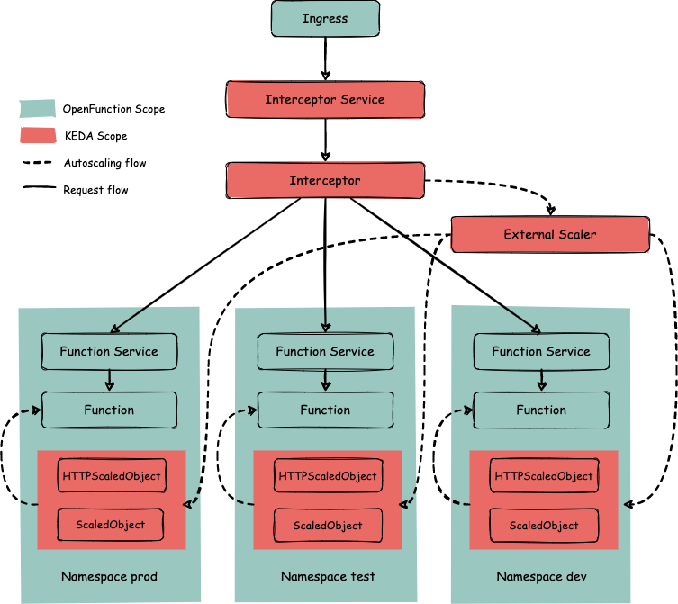

# Integrate KEDA http-addon

## Motivation
OpenFunction has released v1.1.1, and [keda-http-addon](https://github.com/kedacore/http-add-on/) has been updated to v0.5.0. Now we can try to add support for keda-http-addon.

In OpenFunction v1beta2 version API, `trigger` and `inputs` have been separated, so keda-http-addon can take over the part of `HttpTrigger`; on the other hand, integrating keda-http-addon also helps to unify the core architecture of OpenFunction and improve consistency.

## Associated issue

- https://github.com/OpenFunction/OpenFunction/issues/162

## Goals
Integrate [keda-http-addon](https://github.com/kedacore/http-add-on/) into OpenFunction.

## Proposal

### Overview

- **Request**:
  1. When a function is created, a function service and an HTTPScaledObject resource are created for it under the same namespace (HTTPScaledObject will automatically create the corresponding ScaledObject resource).  
  2. Users access the service through the address exposed by OpenFunction Gateway.
  3. The requests reach the Interceptor Service through the entry point and are then passed to the Interceptor Deployment.
  4. Interceptor Deployment delivers the requests to the corresponding Function Service based on the information in the Routing Table, which then receives and processes it.
- **Auto-scaling**:
  1. In step 3 of the Request process, the Interceptor Deployment counts the requests, which are periodically collected and aggregated by the External Scaler Deployment.
  2. External Scaler Deployment reports request counts to the KEDA operator.
  3. KEDA scales the target (Function) that reaches the threshold value according to the scaling options.
- **Inject Dapr sidecar**:
  1. Dapr control plane includes the [dapr-sidecar-injector service](https://docs.dapr.io/operations/hosting/kubernetes/kubernetes-overview/), which watches for new pods with the `dapr.io/enabled` annotation and injects a container with the `daprd` process within the pod.
  2. In this case, sidecar arguments can be passed through annotations as outlined in the **Kubernetes annotations** column in [this table](https://docs.dapr.io/reference/arguments-annotations-overview/).




### CRD

Add an `HTTPScaledObject ` type in `OpenFunction/apis/core/v1beta2/serving_types.go`:

```go
type HTTPScaledObject struct {
	// Target metric value
	// +optional
	TargetPendingRequests *int32 `json:"targetPendingRequests,omitempty"`
	// Cooldown period value
	// +optional
	CooldownPeriod *int32 `json:"cooldownPeriod,omitempty"`
}

type KedaScaleOptions struct {
	// +optional
	ScaledObject *KedaScaledObject `json:"scaledObject,omitempty"`
	// +optional
	HTTPScaledObject *HTTPScaledObject `json:"httpScaledObject,omitempty"`
	// +optional
	ScaledJob *KedaScaledJob `json:"scaledJob,omitempty"`
	// Triggers are used to specify the trigger sources of the function.
	// The Keda (ScaledObject, ScaledJob) configuration in ScaleOptions cannot take effect without Triggers being set.
	// +optional
	Triggers []kedav1alpha1.ScaleTriggers `json:"triggers,omitempty"`
}
```

To differ `keda-http addon` runtime from `knative` runtime, we can add an `Engine` section into `HttpTrigger`:

```go
type Engine string

const (
	HookPolicyAppend   = "Append"
	HookPolicyOverride = "Override"

	WorkloadTypeJob                = "Job"
	WorkloadTypeStatefulSet        = "StatefulSet"
	WorkloadTypeDeployment         = "Deployment"
	HttpRuntimeKnative      Engine = "knative"
	HttpRuntimeKeda         Engine = "keda"
)

type HttpTrigger struct {
	// The port on which the function will be invoked
	Port *int32 `json:"port,omitempty"`
	// Information needed to make HTTPRoute.
	// Will attempt to make HTTPRoute using the default Gateway resource if Route is nil.
	//
	// +optional
	Route *RouteImpl `json:"route,omitempty"`
	// Http function runtime engine, can be set to knative or keda, default to knative if not set
	// +optional
	Engine *Engine `json:"engine,omitempty"`
}
```

The [controllers/core/serving_controller.go#L214](https://github.com/OpenFunction/OpenFunction/blob/main/controllers/core/serving_controller.go#L214) will be like this:

```go
func (r *ServingReconciler) getServingRun(s *openfunction.Serving) core.ServingRun {
	if s.Spec.Triggers.Http != nil {
		if *s.Spec.Triggers.Http.Engine == openfunction.HttpRuntimeKeda {
			return kedahttp.NewServingRun(r.ctx, r.Client, r.Scheme, r.Log)
		} else {
			return knative.NewServingRun(r.ctx, r.Client, r.Scheme, r.Log)
		}
	} else {
		return openfuncasync.NewServingRun(r.ctx, r.Client, r.Scheme, r.Log)
	}
}
```

The hello-world-go `function-sample.yaml` will be like this:

```yaml
apiVersion: core.openfunction.io/v1beta2
kind: Function
metadata:
  name: function-sample
  namespace: keda # must be in the same namespace with keda http-addon
spec:
  version: "v2.0.0"
  image: "stefanprodan/podinfo"
  serving:
    triggers:
      http:
        engine: "keda" # optional, default to knative if not set
        port: 9898
        route:
          gatewayRef:
            name: openfunction
            namespace: openfunction
          hostnames:
            - "podinfo.com"
          rules:
            - matches:
                - path:
                    type: PathPrefix
                    value: /
    scaleOptions:
      minReplicas: 0
      maxReplicas: 10
      keda:
        httpScaledObject:
          targetPendingRequests: 100 # Default 100
          cooldownPeriod: 60 # Default 300
    template:
      containers:
        - name: function # DO NOT change this
          imagePullPolicy: IfNotPresent
```


### Demo

#### Step 1: Configure Dapr state store component & Ingress

#### Step 2: Create Input Deployment & Service & HTTPScaledObject

```yaml
kind: HTTPScaledObject
apiVersion: http.keda.sh/v1alpha1
metadata:
   name: <async-input>
spec:
   host: <async-demo.com>
   targetPendingRequests: 100
   scaleTargetRef:
       deployment: <async-input>
       service: <async-input-svc>
       port: 80
   replicas:
       min: 0
       max: 10
```

#### Step 3: Configure Output Deployment & ScaledObject

```yaml
apiVersion: keda.sh/v1alpha1
kind: ScaledObject
metadata:
  name: <async-output-app>
spec:
  scaleTargetRef:
    kind: Deployment
    name: <async-output>
  triggers:
  - type: redis
    metadata:
      address: <redis-master.default.svc.cluster.local:6379>
      listName: <async-input||order_1>
      listLength: "1"
```

#### Step 4: Trigger the Function

```shell
curl <ingress svc ip> -H "Host: async-demo.com"
```

The `HTTPScaledObject` will be triggered by the HTTP request; and then the `ScaledObject` will be triggered by the redis-input event, eventually getting the input data.


### Serving

The `HTTPScaledObject` can fetch the required `hosts[]`、`port`、`pathPrefixes`、`scaleTargetRef.service` from `s.Spec.Triggers.Http.Route`.

More detailed reconcile code: [pkg/k8s/scaledobject.go](https://github.com/kedacore/http-add-on/blob/main/pkg/k8s/scaledobject.go) , [operator/controller/http/scaled_object.go](https://github.com/kedacore/http-add-on/blob/main/operator/controllers/http/scaled_object.go)

#### change:

[apis/core/v1beta2/serving_types.go](https://github.com/OpenFunction/OpenFunction/blob/main/apis/core/v1beta2/serving_types.go)

[controllers/core/serving_controller.go](https://github.com/OpenFunction/OpenFunction/blob/main/controllers/core/serving_controller.go)

#### add:

[pkg/core/serving](https://github.com/OpenFunction/OpenFunction/tree/main/pkg/core/serving)/kedahttp/servingrun.go

```go
func (r *servingRun) createHttpScaledObject(s *openfunction.Serving, cm map[string]string) (client.Object, error) {
    //generate deployment, service and HTTPScaledObject
}
```


### Purpose

By integrating keda-http-addon, we can reduce learning costs for users and remove the feeling of fragmentation in use.


## Action items
- [ ] Adjust OpenFunction CRD and Controller