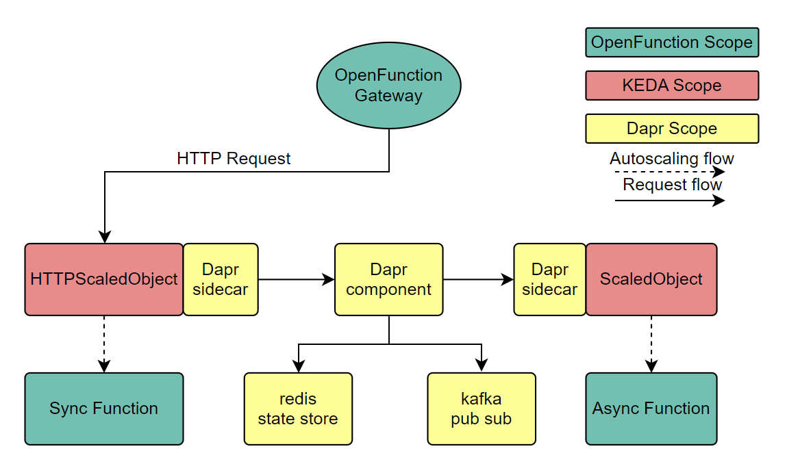

# Integrate KEDA http-add-on

## Motivation
OpenFunction has released v1.1.1, and [keda-http-addon](https://github.com/kedacore/http-add-on/) has been updated to v0.5.0. Now we can try to add support for keda-http-addon.

In OpenFunction v1beta2 version API, `trigger` and `inputs` have been separated, so keda-http-addon can take over the part of `HttpTrigger`; on the other hand, integrating keda-http-addon also helps to unify the core architecture of OpenFunction and improve consistency. 

## Associated issue

- https://github.com/OpenFunction/OpenFunction/issues/162

## Goals
Integrate [keda-http-addon](https://github.com/kedacore/http-add-on/) into OpenFunction.

## Proposal

### Overview

- **Request**:
  1. When a function is created, a function service and an HTTPScaledObject resource are created for it under the same namespace (HTTPScaledObject will automatically create the corresponding ScaledObject resource).  
  2. Users access the service through the address exposed by Ingress.
  3. The requests reach the Interceptor Service through the entry point and are then passed to the Interceptor Deployment.
  4. Interceptor Deployment delivers the requests to the corresponding Function Service based on the information in the Routing Table, which then receives and processes it.
- **Auto-scaling**:
  1. In step 3 of the Request process, the Interceptor Deployment counts the requests, which are periodically collected and aggregated by the External Scaler Deployment.
  2. External Scaler Deployment reports request counts to the KEDA operator.
  3. KEDA scales the target (Function) that reaches the threshold value according to the scaling options.
- **Inject Dapr sidecar**:
  1. Dapr control plane includes the [dapr-sidecar-injector service](https://docs.dapr.io/operations/hosting/kubernetes/kubernetes-overview/), which watches for new pods with the `dapr.io/enabled` annotation and injects a container with the `daprd` process within the pod.
  2. In this case, sidecar arguments can be passed through annotations as outlined in the **Kubernetes annotations** column in [this table](https://docs.dapr.io/reference/arguments-annotations-overview/).




### CRD

Add an `HTTPScaledObject ` type in `OpenFunction/apis/core/v1beta2/serving_types.go`:

```go
type HTTPScaledObject struct {
	// Minimum amount of replicas to have in the deployment (Default 0)
	// +optional
	MinReplicaCount *int32 `json:"minReplicaCount,omitempty"`
	// Maximum amount of replicas to have in the deployment (Default 100)
	// +optional
	MaxReplicaCount *int32 `json:"maxReplicaCount,omitempty"`
	// Target metric value
	// +optional
	TargetPendingRequests *int32 `json:"targetPendingRequests,omitempty"`
	// Cooldown period value
	// +optional
	CooldownPeriod *int32 `json:"cooldownPeriod,omitempty"`
}

type KedaScaleOptions struct {
	// +optional
	ScaledObject *KedaScaledObject `json:"scaledObject,omitempty"`
	// +optional
	HTTPScaledObject *HTTPScaledObject `json:"httpScaledObject,omitempty"`
	// +optional
	ScaledJob *KedaScaledJob `json:"scaledJob,omitempty"`
	// Triggers are used to specify the trigger sources of the function.
	// The Keda (ScaledObject, ScaledJob) configuration in ScaleOptions cannot take effect without Triggers being set.
	// +optional
	Triggers []kedav1alpha1.ScaleTriggers `json:"triggers,omitempty"`
}
```

The `Function` yaml will be like this:

```yaml
apiVersion: core.openfunction.io/v1beta2
kind: Function
metadata:
  name: logs-async-handler
spec:
  version: "v2.0.0"
  image: openfunctiondev/logs-async-handler:v1
  imageCredentials:
    name: push-secret
  build:
    builder: openfunction/builder-go:latest
    env:
      FUNC_NAME: "LogsHandler"
      FUNC_CLEAR_SOURCE: "true"
#     # Use FUNC_GOPROXY to set the goproxy if failed to fetch go modules
#     FUNC_GOPROXY: "https://goproxy.cn"
    srcRepo:
      url: "https://github.com/OpenFunction/samples.git"
      sourceSubPath: "functions/async/logs-handler-function/"
      revision: "main"
  serving:
    triggers:
      http:
        port: "8080"
        route:
          hostnames:
            - "async-demo.com"
          rules:
            - matches:
                - path:
                    type: PathPrefix
                    value: /
              backendRefs:
                - name: async-demo-svc
                  port: 8080
        inputs:
          - type: binding.kafka 
            name: kafka-input
          - type: pubsub.rocketmq
            name: rocketmq-input
            topic: sample
          - type: state.redis
            name: redis-input 
      dapr:
        - type: binding.kafka
          name: kafka-receiver
        - type: pubsub.rocketmq
          name: rocketmq-server
          topic: sample
        - type: state.redis
          name: redis-output 
    outputs:
      - name: notify
        component: notification-manager
        operation: "post"
    bindings:
      kafka-receiver:
        type: bindings.kafka
        version: v1
        metadata:
          - name: brokers
            value: "kafka-server-kafka-brokers:9092"
          - name: authRequired
            value: "false"
          - name: publishTopic
            value: "logs"
          - name: topics
            value: "logs"
          - name: consumerGroup
            value: "logs-handler"
      notification-manager:
        type: bindings.http
        version: v1
        metadata:
          - name: url
            value: http://notification-manager-svc.kubesphere-monitoring-system.svc.cluster.local:19093/api/v2/alerts
    scaleOptions:
      keda:
        scaledObject:
          pollingInterval: 15
          minReplicaCount: 0
          maxReplicaCount: 10
          cooldownPeriod: 60
          advanced:
            horizontalPodAutoscalerConfig:
              behavior:
                scaleDown:
                  stabilizationWindowSeconds: 45
                  policies:
                  - type: Percent
                    value: 50
                    periodSeconds: 15
                scaleUp:
                  stabilizationWindowSeconds: 0
        # httpScaledObject:
        #   minReplicaCount: 0
        #   maxReplicaCount: 10
        #   targetPendingRequests: 100
        #   cooldownPeriod: 60
        ## The triggers definition for KEDA should be moved back to keda
        triggers:
          - type: kafka
            metadata:
              topic: logs
              bootstrapServers: kafka-server-kafka-brokers.default.svc.cluster.local:9092
              consumerGroup: logs-handler
              lagThreshold: "20"
    template:
      containers:
        - name: function # DO NOT change this
          imagePullPolicy: IfNotPresent
    hooks:
      pre:
        - pre-hook1
        - pre-hook2
      post:
        - post-hook2
        - post-hook1
    tracing:
      enabled: true
      provider:
        name: opentelemetry
        exporter:
          name: jaeger
          endpoint: "http://localhost:14268/api/traces"
      tags:
        func: sample-binding
        layer: faas
      baggage:
        key: opentelemetry
        value: v1.23.0
```

### Example

#### Step 1: Configure Dapr state store component & Ingress

#### Step 2: Create Input Deployment & Service & HTTPScaledObject

```yaml
kind: HTTPScaledObject
apiVersion: http.keda.sh/v1alpha1
metadata:
   name: <async-input>
spec:
   host: <async-demo.com>
   targetPendingRequests: 100
   scaleTargetRef:
       deployment: <async-input>
       service: <async-input-svc>
       port: 80
   replicas:
       min: 0
       max: 10
```

#### Step 3: Configure Output Deployment & ScaledObject

```yaml
apiVersion: keda.sh/v1alpha1
kind: ScaledObject
metadata:
  name: <async-output-app>
spec:
  scaleTargetRef:
    kind: Deployment
    name: <async-output>
  triggers:
  - type: redis
    metadata:
      address: <redis-master.default.svc.cluster.local:6379>
      listName: <async-input||order_1>
      listLength: "1"
```

#### Step 4: Trigger the Function

```shell
curl <ingress svc ip> -H "Host: async-demo.com"
```

The `HTTPScaledObject` will be triggered by the HTTP request; and then the `ScaledObject` will be triggered by the redis-input event, eventually getting the input data.

### Controller

The `HTTPScaledObject` can fetch the required `hosts[]`、`port`、`pathPrefixes`、`scaleTargetRef.service` from `controllers/core/function_controller.go`(#L774).

`controllers/core/serving_controller.go` #L214 will be like this:

```go
func (r *ServingReconciler) getServingRun(s *openfunction.Serving) core.ServingRun {
	if s.Spec.Triggers.Http != nil {
		if s.Spec.ScaleOptions.Keda.HttpScaledObject != nil {
			return openfuncsync.NewServingRun(r.ctx, r.Client, r.Scheme, r.Log)
		} else {
			return knative.NewServingRun(r.ctx, r.Client, r.Scheme, r.Log)
		}
	} else {
		return openfuncasync.NewServingRun(r.ctx, r.Client, r.Scheme, r.Log)
	}
}
```

More detailed reconcile code: [pkg/k8s/scaledobject.go](https://github.com/kedacore/http-add-on/blob/main/pkg/k8s/scaledobject.go) , [operator/controller/http/scaled_object.go](https://github.com/kedacore/http-add-on/blob/main/operator/controllers/http/scaled_object.go)

#### change:

[apis/core/v1beta2/serving_types.go](https://github.com/OpenFunction/OpenFunction/blob/main/apis/core/v1beta2/serving_types.go)

[controllers/core/serving_controller.go](https://github.com/OpenFunction/OpenFunction/blob/main/controllers/core/serving_controller.go)

#### add:

[pkg/core/serving](https://github.com/OpenFunction/OpenFunction/tree/main/pkg/core/serving)/openfuncsync/servingrun.go


## Action items
- [ ] Adjust OpenFunction CRD and Controller